**babel通过编译器将ES6、ts、react等等的代码转换成统一的ES5代码** 

# babel转化流程

## babel的工作流程

- 解析阶段
- 转换阶段
- 生成阶段

## 单独转化文件

单独执行babel可以使用 `npx babel src --out-dir dist --presets=@babel/preset-env`

上述代码将会对src下的文件进行转化操作，然后将转化后的文件存到dist目录下。

## webpack转化文件(需要配置)

`npx webpack`即可进行打包

默认不配置webpack的情况下，webpack只输出模块化的内容。

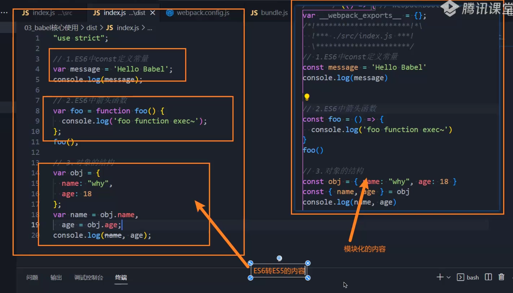

### webpack配置babel

babel-loader会自动使用babel工具，自动转化js代码，最后再输出打包文件。babel-loader是实现转化的中间桥梁。

```js
  module: {
    rules: [
      // 处理jsx和js文件
      {
        test: /\.jsx?$/, //x?:存在一个或者零个x
        // 不处理node_modules下的文件
        exclude: /node_modules/,

        // 在webpack中结合使用Babel-loader对代码进行编译转化
        use: {
          loader: "babel-loader"
        }
      },
    ]
  },
```

`npm install babel-loader -D`

**注意！这里并没有执行babel的转换，babel默认情况下不知道转换哪些代码，你必须要要通过use来指定需要转换的对象！**

use通过设置options来指定需要转化代码所需要的工具，从而进行识别和转化。

```js
  module: {
    rules: [
      // 处理jsx和js文件
      {
        test: /\.jsx?$/, //x?:存在一个或者零个x
        // 不处理node_modules下的文件
        exclude: /node_modules/,

        // 在webpack中结合使用Babel-loader对代码进行编译转化
        use: {
          loader: "babel-loader",
       		options:{
                plugins:[
                "@babel/plugin-transform-arrow-functions",
                "@babel/plugin-transform-block-scoping"
            	]
       		}
        }
      },
    ]
  },
```

 `@babel/plugin-transform-arrow-functions`用于将箭头函数语法转换为普通函数表达式的形式。

`@babel/plugin-transform-block-scoping` 将 ES6/ES2015 中引入的 `let` 和 `const` 声明转换为 ES5 中的变量声明（使用 `var`）以实现块级作用域。

### babel-preset

`npm install @babel/preset-env`

```js
  module: {
    rules: [
      // 处理jsx和js文件
      {
        test: /\.jsx?$/, //x?:存在一个或者零个x
        // 不处理node_modules下的文件
        exclude: /node_modules/,

        // 在webpack中结合使用Babel-loader对代码进行编译转化
        use: {
          loader: "babel-loader",
       		options:{
                presets:[
                   ["@babel/preset-env"]
                ]
       		}
        }
      },
    ]
  },
```

使用 ` presets: ["@babel/preset-env"]`，利用预设轻松地完成所有语法的转化。

为什么要使用数组来包裹，因为里面可能会有更多的预设内容：

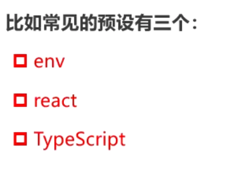

# Babel的配置文件

babel提供了两种独立配置文件的编写：

- babel.config.js(推荐)

  可直接作用于Monorepos项目的子包，使得子包可以共享同一套babel.config.js配置

  比如babel=>core/preset-env/arrow-functions/其它cli...

- .babelrc.json

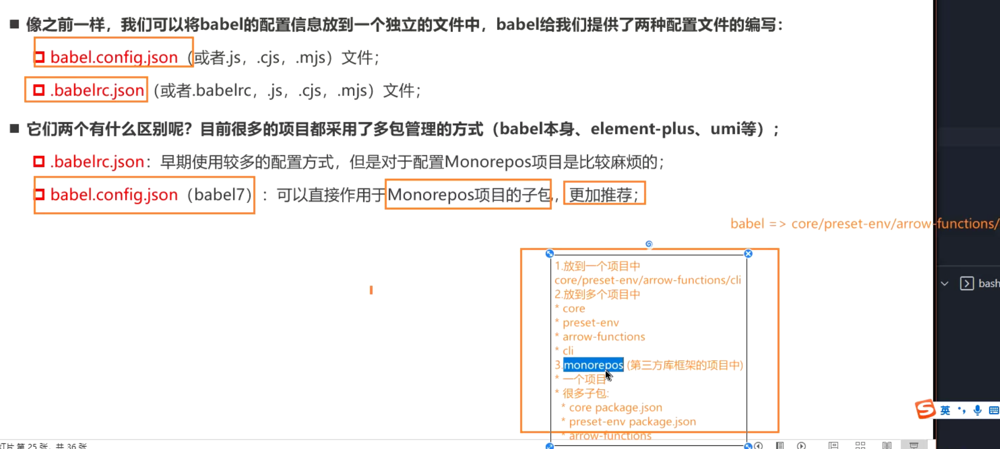

# 浏览器兼容性

大多数浏览器厂商都使用Blink内核。

css和js都存在一定的兼容性问题，为了解决开发中考虑兼容性的痛点，所以我们需要转换这些语言的工具，也就是把新特性语法转换成旧语法来使用(polyfill)。

比如postcss用于转换css特性。

比如babel用于转换js特性。

我们需要对旧的浏览器版本进行兼容转化，但是新浏览器无需进行转换浪费性能。

所以，我们要适配浏览器的类型和版本进行动态地选择性转化。

这时，.browserlistrc配置文件就要闪亮登场了。

市场占用率小的浏览器直接排除，毕竟兼容最近的N的版本。

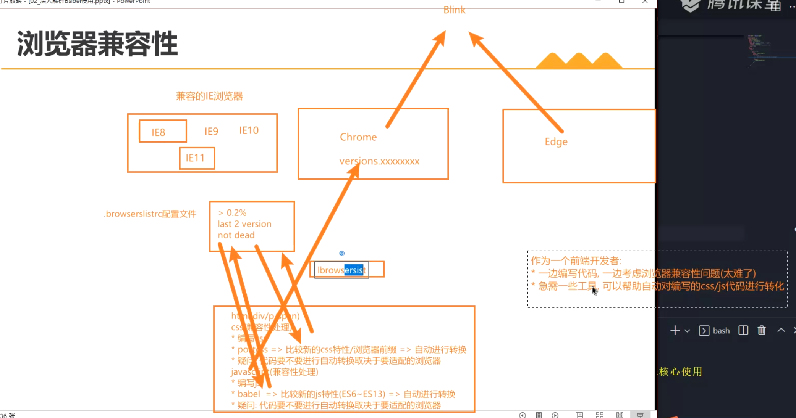

## 浏览器占用率

利用caniuse进行查询。


## Browserslist

Browserslist无需手动安装，在安装babel的时候已经安装进webpack了。

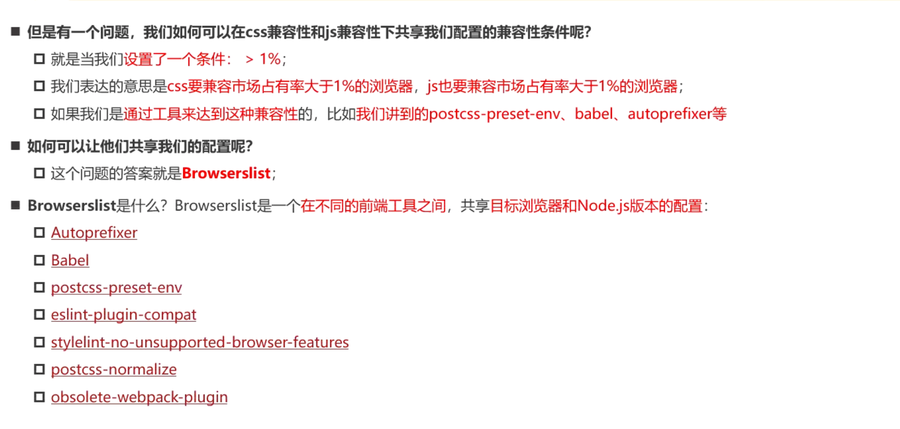

Browserslist和转化插件相辅相成，它会把兼容浏览器版本告知转化插件，使得转化插件将目标代码转化成符合市场上绝大多数浏览器的代码。

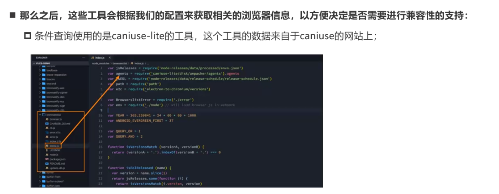

### 编写规则

defaults:对应默认浏览器的配置(>0.5%,last 2 versions,not dead)

1.通过命令行 `npx browserslist ">1%,last 2 version,not dead"`进行兼容设置。

2.在项目下的.browserlistrc进行配置即可。

```
> 2%
last 2 versions
not dead  
```

3.在package.json里面配置broswerlist即可。

**这时候，babel和postcss会选择性地根据浏览器特性版本，进行代码的转化。如果兼容浏览器版本越高，那么需要转化的代码可能就会越少。**

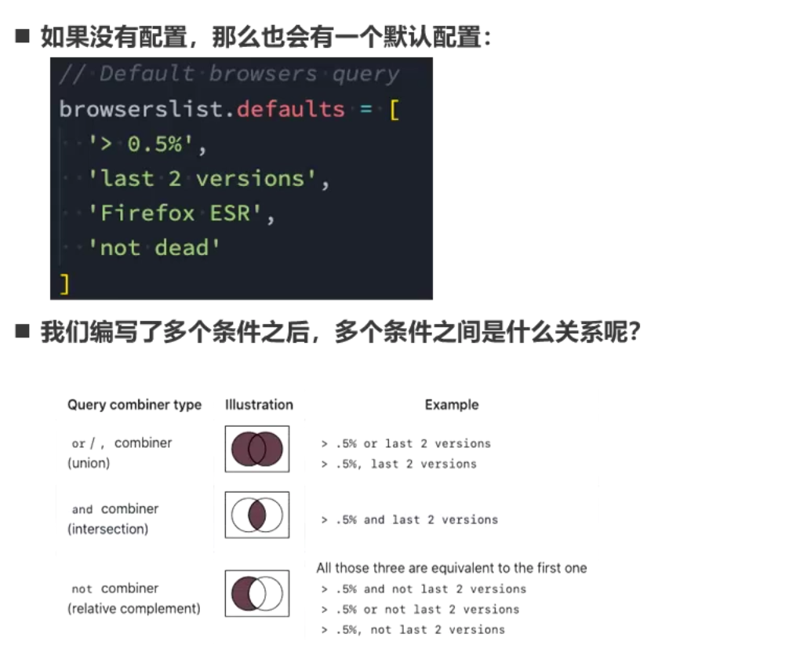

,和换行都是or条件，and则是联合满足条件,not需要符合条件。

not dead指的是24个月内都有更新浏览器，表示持续维护。

**注意，面试如果问到JS和CSS的兼容的时候，可以引用这一点结合babel,postcss来回答。**

# polyfill

除了ES6特殊语法以外，还可能包含了其它需要转化的语法：

- Promise
- 特殊的API，比如string.includes()

这类特殊语法，babel是无能为力的，它不包含此类语法的转化，所以我们需要用到polyfill(垫片)。

针对这些特殊语法，polyfill会为这些语法进行填充和转化，使得一些无法识别这些语法的浏览器能正确引用。

它会自动把特殊语法对应的polyfill全部导入进来，比如说：

`String.prototype.includes`=>String相关的polyfill全部被打包到打包文件里面。

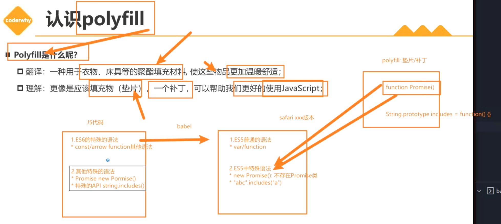

```js
// 使用一些特殊的API，以验证polyfill
// babel不会对新特性的API进行转换操作，它只能执行简单的转换语法操作
const nickInfo = "coderwhy";
console.log(nickInfo.includes("coder"));
```

## 使用polyfill

`npm install core-js regenerator-runtime`

```js
// babel.config.js => 被独立出去的babel options配置
module.exports = {
  presets: [
    [
      "@babel/preset-env",
      {
        // 配置polyfill
        corejs: 3,
        // 设置是否配置polyfill，为false无需设置corejs，此时不使用polyfill
        //usage默认处理当前项目下的代码(除了在webpack babel配置中设置的excludes),
        // 可能导致第三方包无法正常执行(因为没有包括第三方包)
        // entry根据入口文件进行引入
        useBuiltIns: "entry"
      }
    ],
  ]
};

```

1.corejs指定了对应的版本。

2.useBuiltIns意思是设置什么样的方式来使用ployfill。

- false=>不使用polyfill，无需设置corejs属性

- usage(推荐)=>babel在转换时自动检测哪些特殊语法需要进行转换

- entry=>根据入口文件进行处理，处理会囊括处理第三方包，比如axios或者lodash这些特殊的第三方包。

  需要在入口文件添加对应的import(见下图)

  如果不设置这个只会对我们自己写的代码进行打包，但是配置了这个打包文件会比较大。


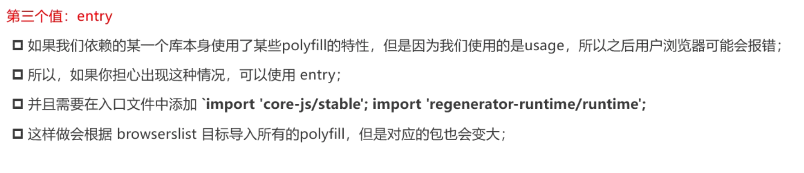

# React jsx支持

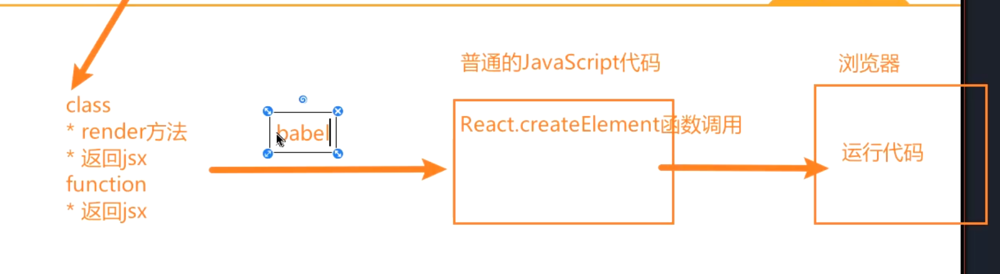

react的转化操作同样依赖于babel，我们先进行安装：

`npm install react react-dom`

再写入react文件(index.js里面也要配置)

```jsx
import React, { memo,useState } from 'react'

const App = memo(() => {
    const [count,setCount] = useState(0)
  return (
      <div>
          <h1>App Count:{count}</h1>
          <button onClick={e=>setCount(count+1)}>+1</button>
    </div>
  )
})

export default App
```

在webpack里面配置

```js
    rules: [
      // 处理jsx和js文件
      {
        test: /\.jsx?$/, //x?:存在一个或者零个x
        // 不处理node_modules下的文件
        exclude: /node_modules/,

        // 在webpack中结合使用Babel-loader对代码进行编译转化
        use: {
          loader: "babel-loader"
          /* 注意：options的配置移入babel.config.js单独配置文件进行配置 */
        }
      },
    ]
```

`npm install @babel/preset-react -D`

在babel.config.js里面配置react相关支持的预设"@babel/preset-react"

```js
// babel.config.js => 被独立出去的babel options配置
module.exports = {
  presets: [
    [
      "@babel/preset-env",
    ],
    ["@babel/preset-react"],
    ]
  ]
};

```

# TypeScript编译

tsc可以把ts代码转化成js代码，在安装typescript会自动安装。

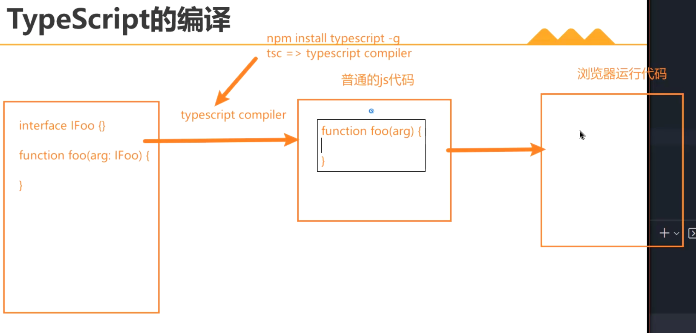

我们需要对ts代码进行一个安装和配置。

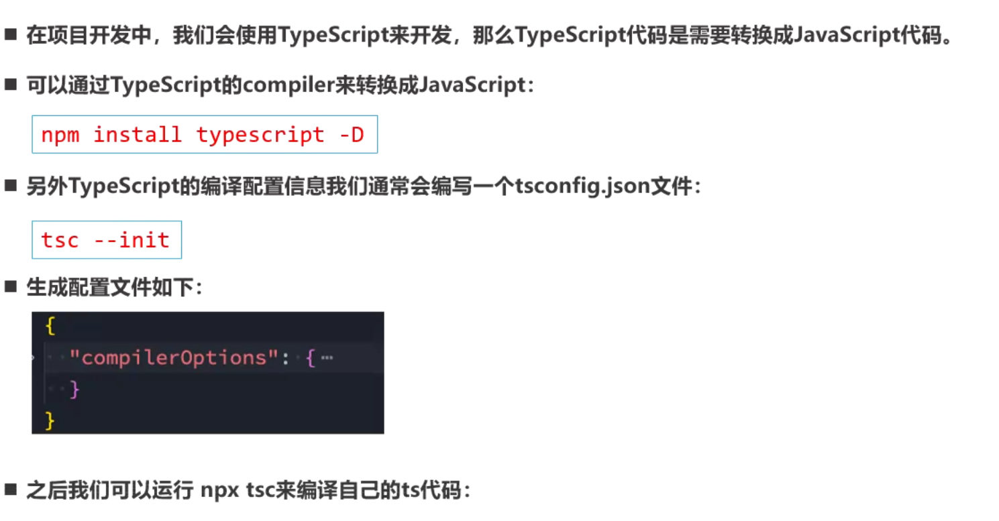

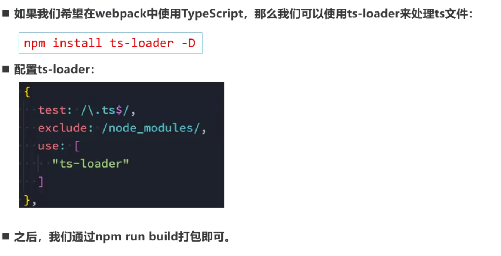

`npm install ts-loader`

在打包编译阶段强制需要tsconfig.json文件进行配置，所以我们需要`tsc --init`生成tsconfig.json文件。

## 缺陷和改进

如果直接使用ts-loader进行打包和配置，会导致ts代码里面的polyfill无法被正常地转化。

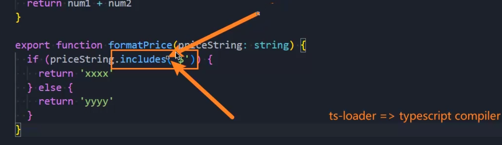

所以我们应该使用babel-loader来处理ts代码，我们需要babel-loader里面的ts预设插件进行依赖使用。

`npm install @babel/preset-typescript -D`

在babel.config.js里面进行配置：

```js
module.exports = {
  presets: [
    [
      "@babel/preset-env",
      {
        corejs: 3,

        useBuiltIns: "entry"
      }
    ],
    ["@babel/preset-react"],
    [
      "@babel/preset-typescript",
      // 在ts代码里面可能包含了需要应用polyfill的代码
      // ts-loader中的typescript complier(tsc)不包含polyfill
      // 所以不要用ts-loader编译ts代码
      // 可以在该ts预设中配置polyfill,这是利用babel-loader处理ts文件的优势
      // 对应的缺点则是babel-loader不会对ts文件的代码进行ts的类型检查
      {
        corejs: 3,
        useBuiltIns: "entry"
      }
    ]
  ]
};

```

通过在@babel/preset-typescript的预设配置文件里面写入polyfill插件，使得我们可以对ts代码里面的特殊语法进行polyfill转化。

### 最终优化

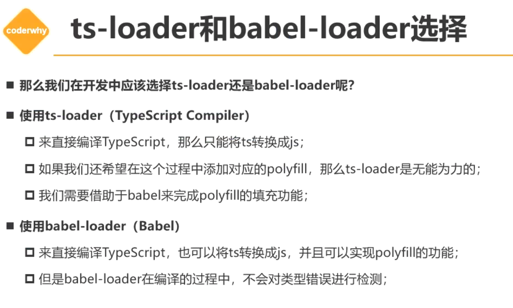

ts-loader会对ts文件的类型进行检测，但是通过@babel/preset-typescript配置以后的ts文件在打包时不会进行错误检测。

如何解决这个问题？

**转化代码用babel-loader,校验代码用tsc。**

在package.json进行配置，我们利用ts-check进行监听，利用ts-check-watch能达到实时监听的效果。所以我们需要ts-check-watch去做错误检查，检查完成以后再执行`npm run build`。

```json
{
  "scripts": {
    "test": "echo \"Error: no test specified\" && exit 1",
    "build": "webpack",
    "ts-check": "tsc --noEmit",
    "ts-check-watch": "tsc --noEmit --watch"
  },
}

```


# html-webpack-plugin

`npm install html-webpack-plugin`

在build里面生成index.html

```js
const path = require("path");
const HtmlWebpackPlugin = require("html-webpack-plugin");
module.exports = {
  mode: "development",
  devtool: false,
  plugins: [
    new HtmlWebpackPlugin({
      template: "./index.html"
    })
  ]
};
```

template指定的模板则是我们目录下的index.html，打包的时候会把index.html同步打包到打包目录下。

# 后缀名自动匹配

```js
module.exports = {
  mode: "development",
  devtool: false,
  resolve: {
    extensions: [".js", ".jsx", ".json", ".ts"]
  },
  // 打包入口文件
  entry: "./src/index.js",
};

```

我们需要在extensions中配置自动识别的后缀名，这样就可以在引用文件(import)时无需添加后缀名。默认只支持js,json,wasm，所以需要我们自行添加。