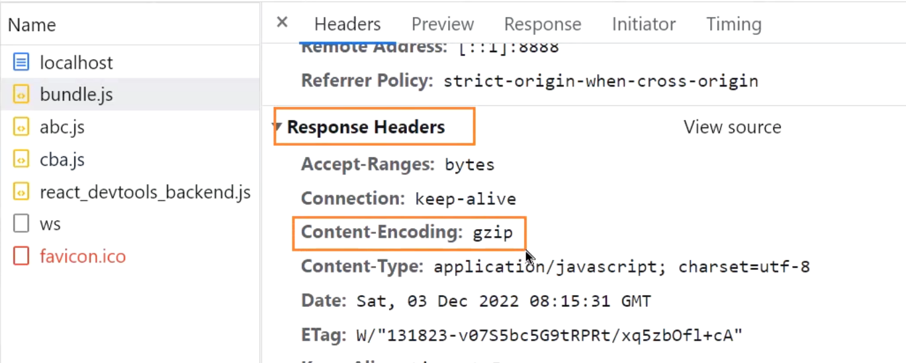

# webpack-dev-server


`npm install webpack-dev-server -D`

webpack-dev-server和live-server的区别在于其具备live reloading(实时重载)功能。

webpack-dev-server在编译之后不会写入到任何输出文件里面，而是将bundle文件保存到内存之中。原理是基于memfs库。


如果需要在index.html 引入其它的script引入静态文件，那么我们就需要在devServer里面的static写入需要引入静态文件的目录。

```js
  devServer: {
    // static是静态资源的意思，这里指定了静态资源的目录
    // static:['public']
    // 就算不写，也是默认从public文件夹里面找静态资源文件
    static: ["public", "content"],
  },
```

这也是为什么字体图标(link标签)是存放在public里面。

## 属性配置

### host


### port

端口号设置，必须设置1024以上的端口

### open

是否自动打开浏览器

### compress

对JS文件执行压缩操作，如果设置为true，则自动对本地运行服务器的代码进行压缩。



### Proxy代理

```js
  devServer: {
    static: ["public", "content"],
    // 编译失败后不重新刷新整个页面，而是更新对应错误部分的代码
    liveReload: false,
    // host 如果改为0.0.0.0 可以使其他人通过本机Ip地址进行访问
    // host:0.0.0.0

    // 设置端口号
    port: 8133,
    // 是否自动打开浏览器
    open: true,
    // compress可以对所有的服务器资源采用gzip压缩
    compress: true,
    proxy: {
      // 当请求的路径是以/api开头的时候，就会触发代理机制
      "/api": {
        target: "http://localhost:9000",
        pathRewrite: {
          "^/api": ""
        },
        // changeOrigin是为了在发送请求给目标服务器的时候，把请求头中的host字段改为目标服务器的地址，
        // 解决服务器校验host的拦截问题
        changeOrigin: true
      }
    },
    historyApiFallback: true
  },
```

记得先搭建并且启动后台服务器，本地项目有api-server。

我们只需要在webpack的devServer配置proxy，就可以实现webpack-dev-server内置的express插件**http-proxy-middleware**的效果了。

 "/api"会把请求的url地址里面的的api/替换成localhost:9000的服务器真实地址。


同时我们需要pathRewrite覆盖掉/api，将其替换为空的字符串，然后将localhost:9000进行替换操作。


注意，跨域问题只会对客户端浏览器产生跨域问题，对node没有任何影响。

因为在node服务器里面静态资源和API指向的是同一个服务器。

#### changeOrigin


changeOrigin会把请求的host设置为Node代理服务器设置的target的同源地址，防止服务器在解析请求获取host参数时，如果发现请求代理服务器和真实请求服务器的host不一致，可能会禁止访问。

一旦设置changeOrigin为true，那么代理服务器和请求服务器的host一致设置为代理服务器的target地址。

### historyApiFallback

如果我们直接在浏览器url地址里面写入/about，但是当前路由不存在，我们又直接刷新了，就会产生404报错。


webpack下这个值默认是false，vue则是true。如果我们将这个值设置为true，就不会发生报错，实际上直接请求的是localhost:3000,会回头请求父级路由，防止报错。