# Webpack性能优化

性能优化常常分为两种方向的优化：

1.打包后的结果，上线时的性能优化(分包处理，减少包体积，CDN服务器)

2.优化打包速度，开发或者构建时优化打包速度(exclude,cache-loader)

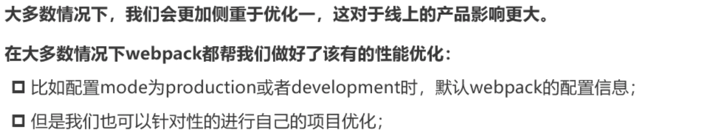

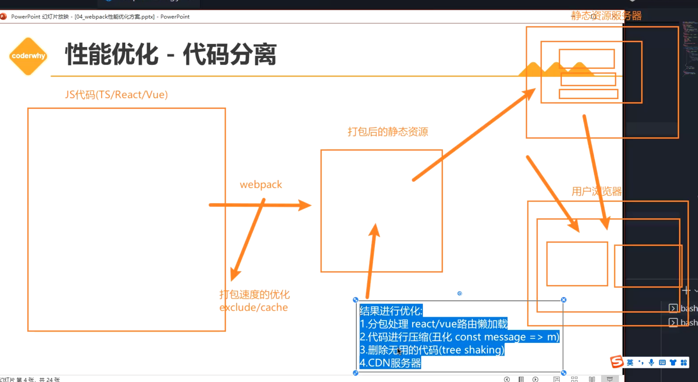

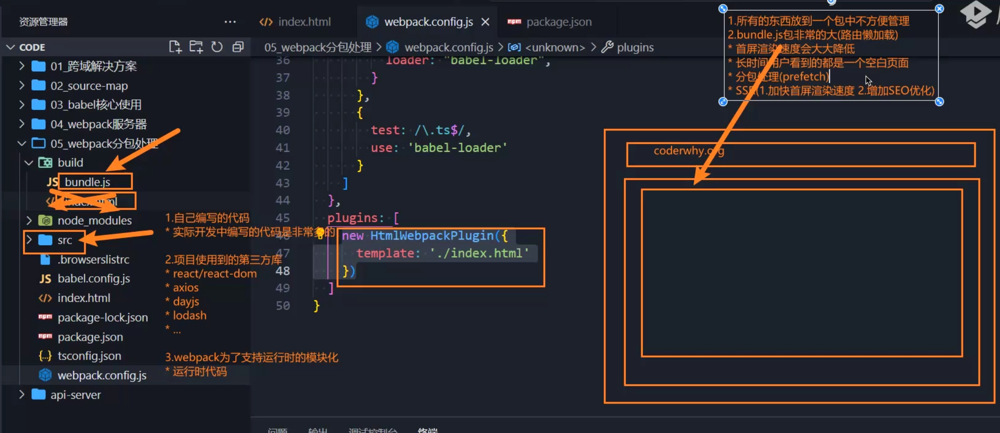

# 代码分离

主要目的是将代码分离到不同的bundle，然后我们再进行按需加载或者并行加载。

特别是首屏渲染速度是至关重要的，默认所有的JS代码都在首页全部加载，会影响渲染速度。

通过代码分离可以分出更小的bundle，借此控制资源加载优先级，提高代码加载性能。

## webpack常用的代码分离

- 入口起点：使用entry配置手动分离代码
- 防止重复：使用Entry Dependencies或者SplitChunksPlugin去重和分离代码
- 动态导入：通过模块的内联函数调用来分离代码

## 多入口打包

```JS
module.exports = {
  mode: "development",
  devtool: false,
  resolve: {
    extensions: [".js", ".jsx", ".json", ".ts"]
  },
  // entry: "./src/index.js",
  // 配置多入口
  entry: {
    index: {
      import: "./src/index.js",
      // 指定需要使用的共享包
      dependOn: "shared"
    },
    main: {
      import: "./src/main.js",
      dependOn: "shared"
    },
    //指定共享的第三方包，防止多次引用引起性能浪费
    // shared可以以不同的属性名写入多个
    shared: ["axios", "react", "react-dom"]
  }
    output: {
    path: path.resolve(__dirname, "./build"),
    // 以下操作步骤为手动分包
    // 利用placeholder来在[]中进行占位操作
    // name会根据不同的入口文件名称进行分类打包，生成对应的打包文件
    filename: "[name]-bundle.js",
    clean: true
  }
};

```

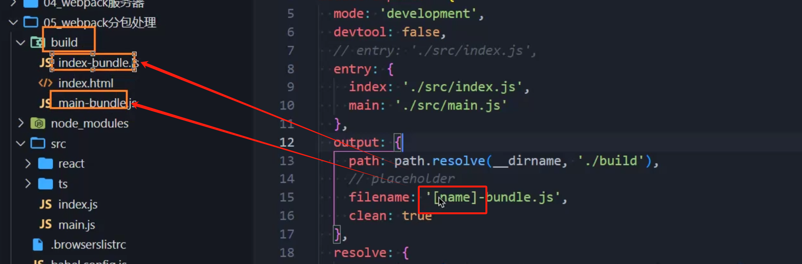

我们可以通过多入口配置，配置多个打包指定的入口，然后在output的filename中根据[name]-bundle.js来生成不同的打包文件。

### 解决多入口打包的缺陷

不同的入口文件如果引用了相同的第三方库，就导致了第三方库会被重复打包。

如果我们想解决这个问题，我们需要在entry配置里面写如shared，正如上面代码的 `   shared: ["axios", "react", "react-dom"]`。

如果我们需要区分不同入口实际应用的第三方库，我们可以通过入口文件配置中的dependOn，指定入口需要shared的第三方库是哪个，shared可以通过递增编号写入多个shared。

## 动态导入

直接使用import()语法来实现动态导入，使用import()可以进行单独的分包，不导入主包里面，大大提高加载性能(特别是首屏渲染)。

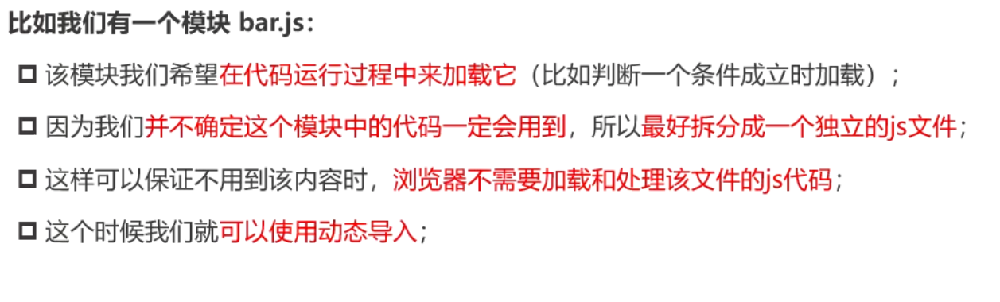

在main.js里面动态地导入文件(模拟路由)

```js
const btn1 = document.createElement("button");
const btn2 = document.createElement("button");
btn1.textContent = "about";
btn2.textContent = "category";
document.body.append(btn1);
document.body.append(btn2);

btn1.onclick = () => {
  // 按需导入，不加入主分包文件，作为一个单独的分包文件
  import("./router/about").then(res => {
    res.about();
    console.log(res.default);
  });
};
btn2.onclick = () => {
  import("./router/category");
};

```

常规的import是在代码顶部直接import './router/about'，如果采用这种方式，所有的文件都会被加载进这个文件里面。

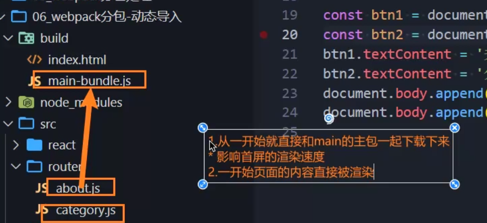

我们的需求就是点击的时候才会把这个页面渲染出来，所以在这里我们需要使用import()，此时webpack认为你是动态引入文件，被动态引入的文件会被单独分包进来，不打包进主包。

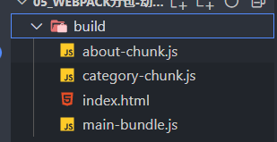

只有在浏览器中点击触发使用该文件时，对应的分包JS文件才会被加载。

注意，如果导入的模块有exports导出的内容，那么可以通过import().then(res=>{......})获取对应的内容，如果导出内容是default导出，那么可以通过res.default()获取默认导出的内容。

### 动态导入文件命名

默认是文件路径-bundle.js的命名方式。

```js
module.exports = {
  mode: "development",
  devtool: false,
  resolve: {
    extensions: [".js", ".jsx", ".json", ".ts"]
  },
  entry: "./src/main.js",
  output: {
    path: path.resolve(__dirname, "./build"),
    filename: "[name]-bundle.js",
    // 针对单独分包的文件进行命名
    chunkFilename: "[name]-chunk.js",
    clean: true
  },
};

```

如果你希望对分包文件进行指定命名，那么可以使用chunkFilename进行命名。

#### 魔法注释

我们可以在import()指定对应的魔法注释，见下代码：

```js
btn1.onclick = () => {
  // 为分包名称加入魔法注释，要结合chunkFilename的占位插槽使用
  import(/*webpackChunkName:"about"*/ "./router/about").then(res => {
    res.about();
    console.log(res.default);
  });
};
btn2.onclick = () => {
  import(/*webpackChunkName:"category"*/ "./router/category");
};

```

通过注释webpackChunkName，指定对应的分包名称，需要和webpack.config.js里面的配置对应命名进行设置。

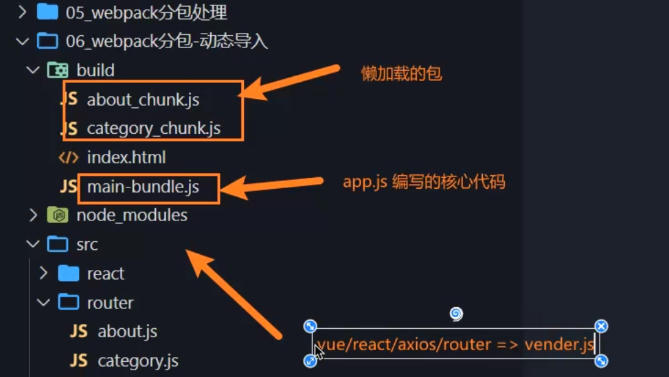

## SplitChunk

**实现第三方包的单独分包。**

底层基于SplitChunksPlugin实现，无需单独安装，已经集成到了webpack里面，只需要提供配置信息即可。

在webpack.config.js里面配置optimization(优化)

```js
  // 优化配置
  optimization: {
    // 针对splitChunks分包配置下占位插槽id的名称生成的chunkId的算法

    // development模式下默认配置为named=>生成的chunkId为文件名
    // production模式下默认配置为deterministic=>生成的chunkId为数字

    // 开发阶段使用named，因为可以方便查看对应的文件
    // 生产环境使用deterministic，因为可以方便进行缓存操作
    // deterministic可以生成一个确定的id，在重复打包时可以直接使用缓存，无需全部重新带包
    chunkIds: "deterministic",

    // runtime的代码是否单独抽取到单独的包中(runtime指的是模块的封装，抽取部分的功能代码)
    // 现在已经无需单独打包runtime了，基本已经默认封装进主包
    runtimeChunk: {
      name: "runtime"
    },
    // 运用了分包插件：SplitChunksPlugin
    splitChunks: {
      // 针对异步操作的分包内容：async
      // 全部的内容进行分包：all
      chunks: "all",
      /* 客制化内容 */
      // 当一个包大于指定的大小时，会继续进行拆包操作
      // (但是如果是一个整体包，就算大于指定大小也可能不会进行拆包操作)
      // maxSize: 20000, //这里的单位是字节
      // 拆包的时候将包拆分成不小于minSize的大小的包
      miniSize: 20,

      // 自己对需要进行拆包的内容进行分组
      cacheGroups: {
        // 所有来自于node_modules的内容都会被打包到vendors组的包中
        vendors: {
          // 这里的正则写法是为了表示严格来自于node_modules，防止有其他文件同名的歧义
          test: /[\\/]node_modules[\\/]/,
          filename: "[id]-vendors.js"
        },
        // 所有来自于utils的内容都会被打包到utils组的包中
        // 如果对应文件小于minSize，那么会默认合并到主包之中，不会进行单独分包

        utils: {
          test: /[\\/]utils[\\/]/,
          filename: "[id]-utils.js"
        }
      }
    },
    // 生产模式下默认运用了webpack内置的代码优化插件：TerserPlugin
    // 该插件会让代码更加简洁=>Terser

    // minimizer=>对代码进行缩减
    minimizer: [
      // JS代码简化
      new TerserPlugin({
        // 是否生成LICENSE.txt文件，提取对应的第三方的注释信息
        extractComments: false //不生成LICENSE.txt文件
      })
      // CSS代码简化
    ]
  },
```

### optimization属性

#### 拆包容量指定

splitChunks里面的chunks属性改成**all**，使得针对全部的内容进行分包处理。

这样一来，main.js里面通过import 导入的第三方包会被独立分包出去，因为import最终指向的插件的路径也是存于node_modules里面，它会在node_modules里面被找到。

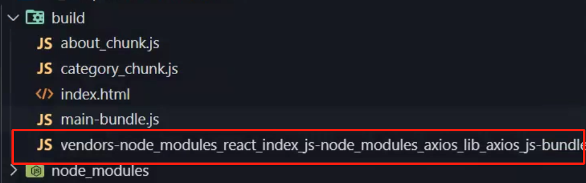

如果我们此时觉得被分出来的包太大了，我们可以使用maxSize来进行继续拆包。

`maxSize:20000`

如果在拆包的时候，我们对包的最小起步容量有需求，则可以写入minSize指定最小容量。

`minSize:10000`

但是其注意，有时候有些函数文件特别大，但是也不可以拆分的，所以这时候不会进行minSize/maxSize拆分。

#### 拆包内容分组

```js
      // 自己对需要进行拆包的内容进行分组
      cacheGroups: {
        // 所有来自于node_modules的内容都会被打包到vendors组的包中
        vendors: {
          // 这里的正则写法是为了表示严格来自于node_modules，防止有其他文件同名的歧义
          test: /[\\/]node_modules[\\/]/,
          filename: "[id]-vendors.js"
        },
        // 所有来自于utils的内容都会被打包到utils组的包中
        // 如果对应文件小于minSize，那么会默认合并到主包之中，不会进行单独分包

        utils: {
          test: /[\\/]utils[\\/]/,
          filename: "[id]-utils.js"
        }
      }
```

使用cacheGroups来指定拆包的对象，vendor针对的是node_modules文件夹，我们需要用**test**进行正则匹配，然后用**filename**来指定输出打包的自定义命名。

 `/[\\/]node_modules[\\/]/`为了完整匹配/node_modules的配置，可以参照官方文档的写法。这种写法既可以匹配/也可以匹配\，为了兼容WIN和MAC的文件目录表示方式。

**注意：如果被拆包的文件大小小于min-size，就算配置了拆包也依然会被导入到主包里面去！**

如果在生产环境条件下打包，那么对应的打包文件会自动生成id-name.js的形式，添加魔法注释的自定义分离包则按照原本自定义的形式进行分包命名。

#### 打包注释文件

使用TerserPlugin去除打包注释文件，webpack内部自动集成，但是需要引入该插件。

```
  const TerserPlugin = require("terser-webpack-plugin");
	......
	......
  // minimizer=>对代码进行缩减
    minimizer: [
      // JS代码简化
      new TerserPlugin({
        // 是否生成LICENSE.txt文件，提取对应的第三方的注释信息
        extractComments: false //不生成LICENSE.txt文件
      })
      // CSS代码简化
    ]
```

#### 自定义chunkId的算法

```js
  optimization: {
    // 针对splitChunks分包配置下占位插槽id的名称生成的chunkId的算法

    // development模式下默认配置为named=>生成的chunkId为文件名
    // production模式下默认配置为deterministic=>生成的chunkId为数字

    // 开发阶段使用named，因为可以方便查看对应的文件
    // 生产环境使用deterministic，因为可以方便进行缓存操作
    // deterministic可以生成一个确定的id，在重复打包时可以直接使用缓存，无需全部重新带包
    chunkIds: "deterministic"

  }
```

deterministic可以生成一个确定的id，在重复打包时可以直接使用缓存，无需全部重新带包。

简单来说就是没有修改的对应文件在打包时会根据这个id不做任何变化，直接缓存利用上一次打包的包即可，只有修改的对应文件打包后会生成新的id和包。

浏览器也会自动识别打包目录下对应id和name的包有没有发生变化，如果没有变化则会直接使用缓存的包，不会进行二次下载。

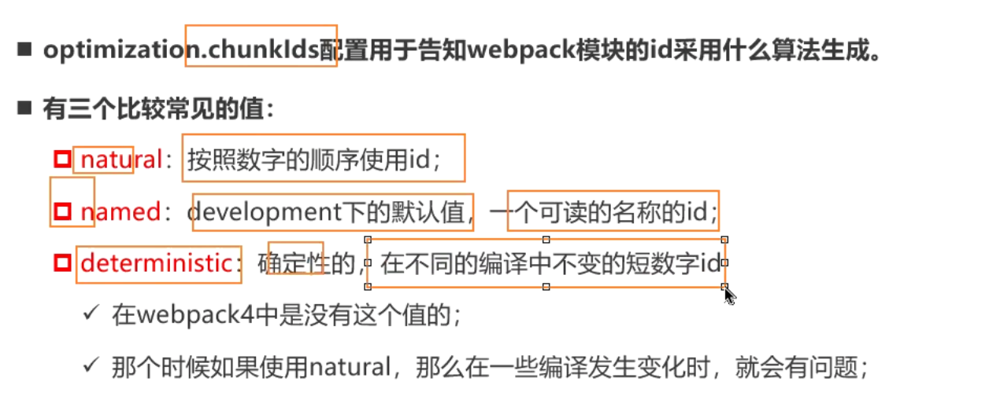

webpack5在生产环境下会默认chunkIds的值为"deterministic"。


在 webpack 中，`optimization` 配置项用于配置优化相关的设置，其中 `chunkId` 的配置选项为 `deterministic`。这个选项决定了生成的 chunk id 是否具有确定性。让我们来解释一下这个配置选项的作用：

### `chunkId: 'deterministic'`

当 `chunkId` 设置为 `'deterministic'` 时，Webpack 会使用确定性的哈希算法生成 chunk id。这意味着，对于相同的代码，无论在何时何地构建，生成的 chunk id 都将是相同的。

#### 作用：

1. **稳定的缓存：** 这个配置选项的主要作用是确保构建输出的 chunk id 对于构建内容的更改是稳定的。这对于缓存是很重要的，因为如果构建内容没有变化，Webpack 生成的 chunk id 也不会变化，使得浏览器可以从缓存中加载这些 chunk。
2. **文件名稳定性：** 稳定的 chunk id 也有助于确保生成的文件名稳定，对于长期缓存和文件版本管理是有益的。

#### 示例：

<pre><div class="bg-black rounded-md"><div class="flex items-center relative text-gray-200 bg-gray-800 dark:bg-token-surface-primary px-4 py-2 text-xs font-sans justify-between rounded-t-md"><span>javascript</span><button class="flex gap-1 items-center"><svg width="24" height="24" viewBox="0 0 24 24" fill="none" xmlns="http://www.w3.org/2000/svg" class="icon-sm"><path fill-rule="evenodd" clip-rule="evenodd" d="M12 4C10.8954 4 10 4.89543 10 6H14C14 4.89543 13.1046 4 12 4ZM8.53513 4C9.22675 2.8044 10.5194 2 12 2C13.4806 2 14.7733 2.8044 15.4649 4H17C18.6569 4 20 5.34315 20 7V19C20 20.6569 18.6569 22 17 22H7C5.34315 22 4 20.6569 4 19V7C4 5.34315 5.34315 4 7 4H8.53513ZM8 6H7C6.44772 6 6 6.44772 6 7V19C6 19.5523 6.44772 20 7 20H17C17.5523 20 18 19.5523 18 19V7C18 6.44772 17.5523 6 17 6H16C16 7.10457 15.1046 8 14 8H10C8.89543 8 8 7.10457 8 6Z" fill="currentColor"></path></svg>Copy code</button></div><div class="p-4 overflow-y-auto"><code class="!whitespace-pre hljs language-javascript">// webpack.config.js

module.exports = {
  // ...
  optimization: {
    chunkIds: 'deterministic',
    // ...
  },
  // ...
};
</code></div></div></pre>

这个配置选项通常用于生产环境，以确保生成的文件名和 chunk id 在构建内容不变的情况下保持稳定，从而提高缓存效果和文件版本管理的可靠性。在开发环境中，通常可以使用默认的配置或者其他更适合调试的配置。

#### runtimeChunk

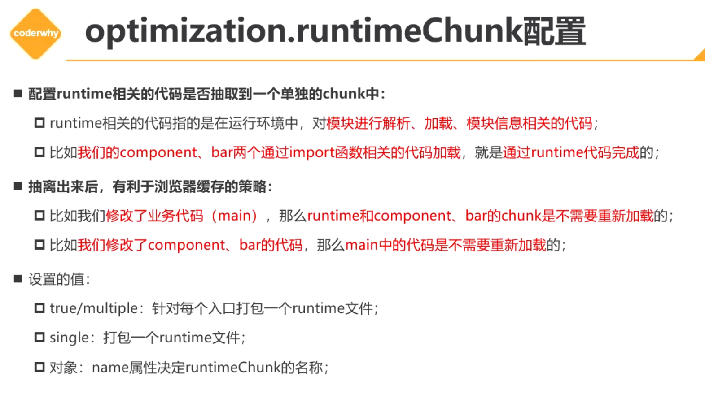

```js
  optimization: {
	// runtime的代码是否单独抽取到单独的包中(runtime指的是模块的封装，抽取部分的功能代码)
	// 现在已经无需单独打包runtime了，基本已经默认封装进主包
	runtimeChunk: {
  		name: "runtime"
	}
}
```

## 预获取和预加载(重要)

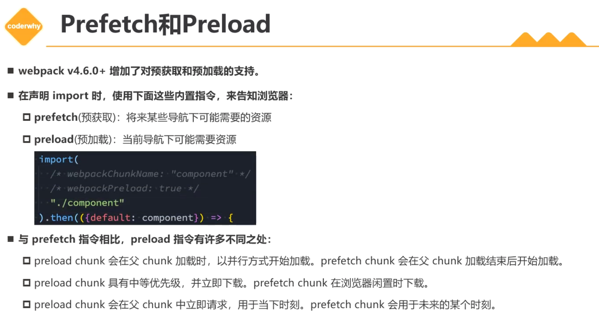

prefetch(推荐)会在浏览器闲置的时候下载，等待加载。

preload不但会下载，也会同步加载。

### 使用方式

无需在webpack.config.js中配置，直接在JS文件中写入相关配置：

```js
btn1.onclick = () => {
  // 第一个魔法注释：用于标记分包的名称
  // 按需导入，不加入主分包文件，作为一个单独的分包文件
  // 为分包名称加入魔法注释，要结合chunkFilename的占位插槽使用

  /* 第二个魔法注释，用于prefetch 
    预获取(prefetch)和预加载(preload)的逻辑不一样，预获取是触发相关动作时才加载，预加载会和浏览器一起同步加载，两者的区别在于预加载会在浏览器空闲时加载，但是预获取是同步浏览器进行加载的
  */
  import(
    /* webpackChunkName:"about" */
    /* webpackPrefetch: true */
    "./router/about"
  ).then(res => {
    res.about();
    console.log(res.default);
  });
};
```

**注意！加载不等于渲染！**
