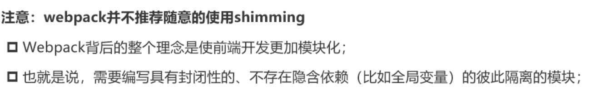

# shimming

垫片，相当于给代码填充垫片来解决问题。

如果我们依赖于第三方库，但是这个第三方库本身依赖lodash，然而默认并没有对lodash进行导入(默认全局存在lodash)，那么我们可以通过ProvidePlugin来实现shimming效果。

**webpack不推荐随意使用shimming，如果第三方插件需要应用某种第三方插件，那就应该直接安装和Import引入**



在某一个JS文件定义一个没有进行安装和导入的库(比如axios)：

```js
// import axios from "axios";
// import dayjs from "dayjs";
/* 在开发环境下，假设这里是第三方库，没有import内部引入，我们可以通过在
   webpack配置中添加ProvidePlugin(webpack内置)来全局引入，这个设置一般是不用的
    */
console.log(axios);
axios.get("http://139.199.212.233:80/moment/list").then(res => {
  console.log(res);
});
console.log(dayjs(new Date()).format("YYYY-MM-DD HH:mm:ss"));
//abc.js
```

```js
  plugins: [
    // ProvidePlugin 全局预设依赖，借此来引入第三方插件/库
    // bug:axios在该垫片应用中会导入一个模块，不能直接使用axios.get
    new ProvidePlugin({
      axios: ["axios", "default"],
      dayjs: "dayjs"
    })
  ]
```

