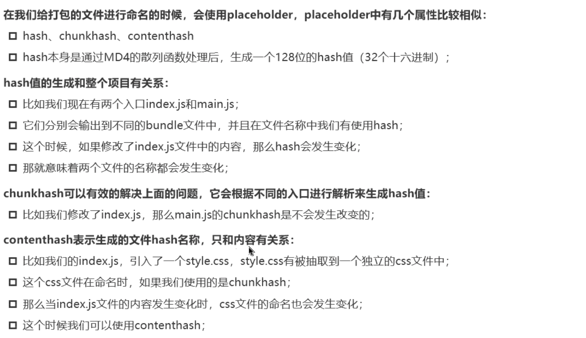
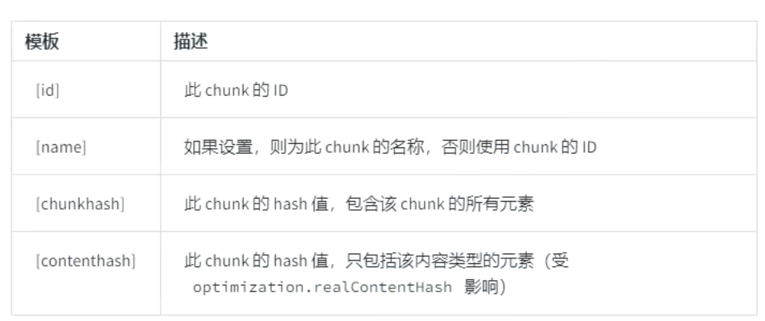
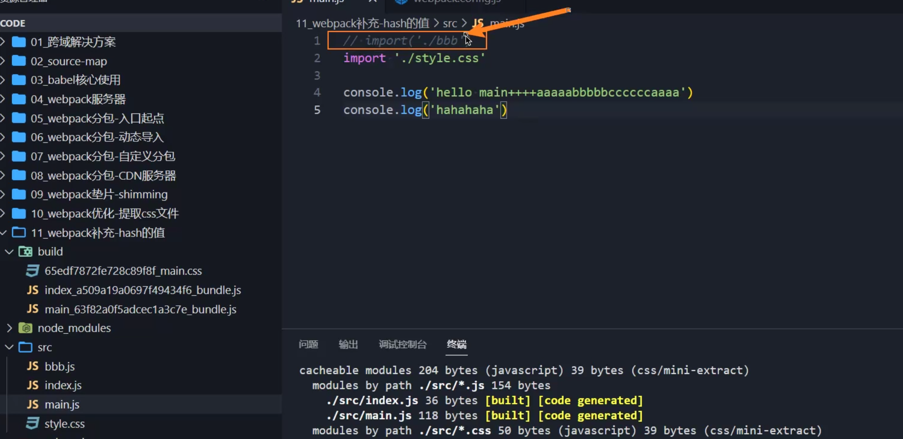

# hash

常见有三种hash值：

- hash
- chunkhash
- contenthash



```js
  output: {
    path: path.resolve(__dirname, "./build"),
    // 以下操作步骤为手动分包
    // 利用placeholder来在[]中进行占位操作
    // name会根据不同的入口文件名称进行分类打包，生成对应的打包文件
    filename: "[name]_[contenthash]-bundle.js",
    chunkFilename: "[name]_[contenthash]-chunk.js",
    clean: true
  },
```

## contenthash(推荐使用)

contenthash的生成是根据文件中实际内容的内容摘要所生成的，如果两个文件的内容完全一致，那么hash值也是相同的。

**hash值决定了浏览器的缓存策略，hash不变的文件在二次读取时浏览器会采取上一次的缓存，不会重复下载。**

如果我们有多入口文件，那么优先采用contenthash来进行缓存策略，contenthash会自动区分哪个入口文件发生改变，然后改变对应的文件名hash值。对于没有发生内容改变的文件，将采取hash值不变的策略有利于浏览器的缓存策略。

## chunkhash

chunkhash的策略和contenthash在缓存识别上的策略的区别如下：

```js
  plugins: [
    new MiniCssExtractPlugin({
      // 为打包后的css文件进行重命名
      filename: "[name]_[chunkhash].css"
    })
  ]
```



**在动态导入(import())的内容方面，两者的缓存策略没有任何区别，完全一致。**

如果不采用动态导入的方式，采用chunkhash，那么在修改文件内容的时候，修改main.js里面的内容，但是不修改style.css的内容，如此打包以后，打包目录下两个文件的hash值都会发生改变。

如果你采用了contenthash作为分包名称：

```js
  plugins: [
    new MiniCssExtractPlugin({
      // 为打包后的css文件进行重命名
      filename: "[name]_[contenthash].css"
    })
  ]
```

同样的修改条件情景下，只有main.js对应的打包文件名称的hash值会发生变化，css打包文件名的hash值不发生变化。