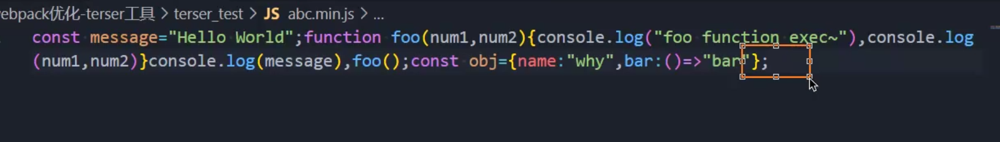

# Terser实现JS代码压缩

命令行工具对JS代码进行压缩和输出。


```shell
npx terser ./src/abc.js -o abc.min.js -c 
arrows,arguments=true,dead_code -m 
toplevel=true,keep_classnames=true,keep_fnames=true
```

◼ Compress option

- arrows：class或者object中的函数，转换成箭头函数；

 

- arguments：将函数中使用 arguments[index]转成对应的形参名称； 


- dead_code：移除不可达的代码（tree shaking）； 


不可达的无效代码在打包文件里面被删除了



◼ Mangle option 

toplevel：默认值是false，顶层作用域中的变量名称，进行丑化（转换）；


keep_classnames：默认值是false，是否保持依赖的类名称； 


 keep_fnames：默认值是false，是否保持原来的函数名称；

## Terser在webpack中配置

真实开发中，我们不需要手动的通过terser来处理我们的代码，我们可以直接通过webpack来处理： 

在webpack中有一个minimizer属性，在production模式下，默认就是使用TerserPlugin来处理我们的代码的； 

如果我们对默认的配置不满意，也可以自己来创建TerserPlugin的实例，并且覆盖相关的配置； 

- 首先，我们需要打开minimize，让其对我们的代码进行压缩（默认production模式下已经打开了） 
- 其次，我们可以在minimizer创建一个TerserPlugin： 

extractComments：默认值为true，表示会将注释抽取到一个单独的文件中； 

- 在开发中，我们不希望保留这个注释时，可以设置为false； 

parallel：使用多进程并发运行提高构建的速度，默认值是true 

- 并发运行的默认数量： os.cpus().length - 1； 
- 我们也可以设置自己的个数，但是使用默认值即可； 

terserOptions：设置我们的terser相关的配置 

- compress：设置压缩相关的选项； 
- mangle：设置丑化相关的选项，可以直接设置为true； 
- toplevel：顶层变量是否进行转换； 
- keep_classnames：保留类的名称； 
- keep_fnames：保留函数的名称；

```js
    // 生产模式下默认运用了webpack内置的代码优化插件：TerserPlugin
    // 该插件会让代码更加简洁=>Terser

    // minimize用于配置是否启用代码压缩,设置true在开发环境也可以应用TerserPlugin配置
    minimize: true,
    // minimizer=>对代码进行缩减
    minimizer: [
      // JS压缩插件:TerserPlugin
      /* 不生效代码和未调用代码默认会自动被删除，除非设置unused为false */
      new TerserPlugin({
        // 是否生成LICENSE.txt文件，提取对应的第三方的注释信息
        extractComments: false, //不生成LICENSE.txt文件
        terserOptions: {
          compress: {
            // 对形参的传参进行优化，省去arguments的传参
            arguments: true
          },
          mangle: true,
          // 压缩变量名
          // toplevel: false
          // 保留函数名
          keep_fnames: true
        }
      })
     ]
```

### minimize

在生产环境下默认为true，开发环境为false，手动设置为true后在开发环境也可以应用压缩配置(minimizer)内容。

minimizer里面主要以 new Plugin({})的形式应用插件来执行压缩策略，比如在这里我们使用new TerserPlugin({})和new CSSMinimizerPlugin({})

#### extractComments

不生成LICENSE.txt文件

### terserOptions

这里对terser的优化策略进行配置

#### mangle

设置丑化的相关选项，直接设置为true即可

##### compress

1.arguments

将形参优化为实际参数的形式

2.unused

保留未实际应用的函数或者参数

#### toplevel

顶层的作用域的函数名和类名等等进行压缩优化

#### keep_fnames

保留函数名不被压缩

### parallel

因为terser基于CPU进行压缩操作，所以使用多进程并行提高构件速度，默认为true

# 实现CSS的压缩

​	

css压缩主要就是为了去空格和换行，因为名称和属性压缩了会导致浏览器无法识别css的设置。

导入CSSMinimizerPlugin

```js
const CSSMinimizerPlugin = require("css-minimizer-webpack-plugin");

```

将其在minimizer中进行应用，该插件全部使用默认设置即可，无需手动配置。

```js
    minimize: true,
    // minimizer=>对代码进行缩减
    minimizer: [
	  // CSS压缩插件：CSSMinimizerPlugin
      // css压缩只能控制空格和换行的成本，不能随意变换变量名或者值
      new CSSMinimizerPlugin({
        // parallel:true 默认开启，无需手动打开
      })
     ]
```

