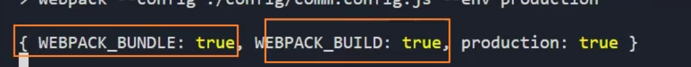

# 实现webpack配置的分离

所有的配置文件放在config文件夹里面，然后对开发环境，生产环境进行分离，并配置一个comm.config.js作为基准文件(共享给开发环境和生产环境)。

### 在package.json里面对不同环境的运行进行区分

```json
    "build": "webpack --config ./config/comm.config.js --env production",
    "serve": "webpack serve --config ./config/comm.config.js --env development",
```

--env后面跟随的参数会输出一个环境变量，不同执行命令对应的是production和development环境，通过--env指定的环境变量(见分离文件)，确定在comm.config.js里面通过识别shell命令执行导出的时候，采用什么样的环境变量执行导出策略。

### 修改打包文件指定目录的位置

```js
    output: {
      path: path.resolve(__dirname, "../build"),
      // 以下操作步骤为手动分包
      // 利用placeholder来在[]中进行占位操作
      // name会根据不同的入口文件名称进行分类打包，生成对应的打包文件
      filename: "js/[name]-bundle.js",
      // 针对单独分包的文件进行命名
      chunkFilename: "js/[name]-chunk.js",
      clean: true
      // 配置publicPath可以为打包好的文件添加一个前缀路径，使得对打包资源的地址引入可以自动配置
      // publicPath:"CDN服务器地址"
    },
```

## 分离文件

操作步骤如下：

1.  将配置文件的导出变更为一个函数，而不是一个对象。
2. 从上往下check所有的配置属性应该配属于哪种环境或者文件(com/dev/prod)
3. 针对单独的配置文件进行定义，比如css的加载使用不同的loader根据isProcution动态地配置

首先分离基准文件，更改原本的导出设置，首先webpack允许导出一个函数，所以我们可以将其变更为以下方式：

```js
const commonConfig={
......
......
}
module.exports=function(env){
    console.log(env)
    const isProd=env.production
    if(isProduction){
 	 ...生产环境配置
    }else{
     ...开发环境配置
    }
   return commonConfig
}
```

env打印内容：



如果是生产环境，那么production的值为true

### 根据类型分离文件

将生产环境webpack配置和开发环境webpack配置分离成两个独立文件，分别是prod.config.js和dev.config.js，然后在各自的配置文件中通过`module.exports={}`单独导出对应的内容。

#### 共享配置

devtools直接使用默认的环境输出即可，entry，output,resolve里面的extensions直接在基准文件里面配置，不用做区分

plugins里面的插件共用的有new HtmlWebpackPlugin,new ProvidePlugin。

同时我们要动态识别不同的环境来对css的配置进行优化：

我们现要把基准文件变为一个函数，以此来接收一个传参识别环境的类型：

```JS
const getCommonConfig = function (isProduction) {
    ......
    ......
}
```


```js
        {
          test: /\.less$/i,
          use: [
            // compiles Less to CSS
            // MiniCssExtractPlugin.loader是以link的形式插入到index.html之中，常用于生产环境
            // MiniCssExtractPlugin.loader,
            // style-loader是以style内联的形式插入到index.html之中,常用于开发环境
            // "style-loader",
            isProduction ? MiniCssExtractPlugin.loader : "style-loader",
            "css-loader",
            "less-loader"
          ]
        }
```


#### 开发环境

开发环境必须留下devServer开发环境服务器配置

#### 生产环境

生产环境留下optimization优化配置

plugins里面的插件单独配置 new MiniCssExtractPlugin进行css的提取操作。

#### 合并输出配置

首先安装一个配置合并插件

`pnpm add webpack-merge -D`

然后引入该插件和其它环境的配置

```js
const { merge } = require("webpack-merge");
const devConfig = require("./dev.config");
const prodConfig = require("./prod.config");
```

在承担输出任务的基准文件里面写入输出策略

```js
/* 
    "build": "webpack --config ./config/comm.config.js --env production",
    "serve": "webpack serve --config ./config/comm.config.js --env development" 
*/
// webpack允许导出一个函数，该函数可以接收一个参数env
// env可以从package.json里面的指令中写入和获取，格式为--env xxxxxx
module.exports = function (env) {
  const isProduction = env.production;
  let mergeConfig = isProduction ? prodConfig : devConfig;
  // 安装webpack-merge插件=>pnpm add webpack-merge -D
  // 利用webpack-merge插件的merge合并开发、生产、共用的webpack配置
  return merge(getCommonConfig(isProduction), mergeConfig);
};
```

