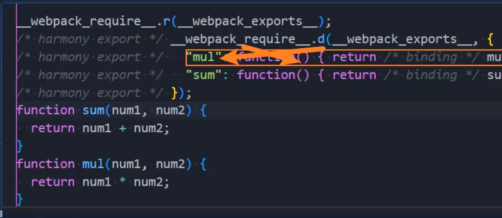
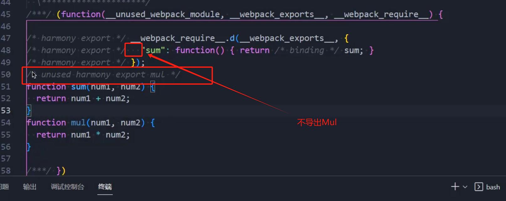
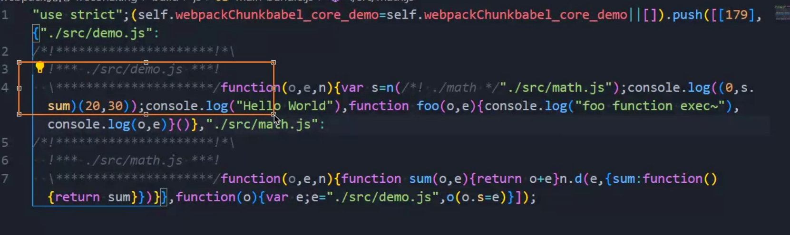
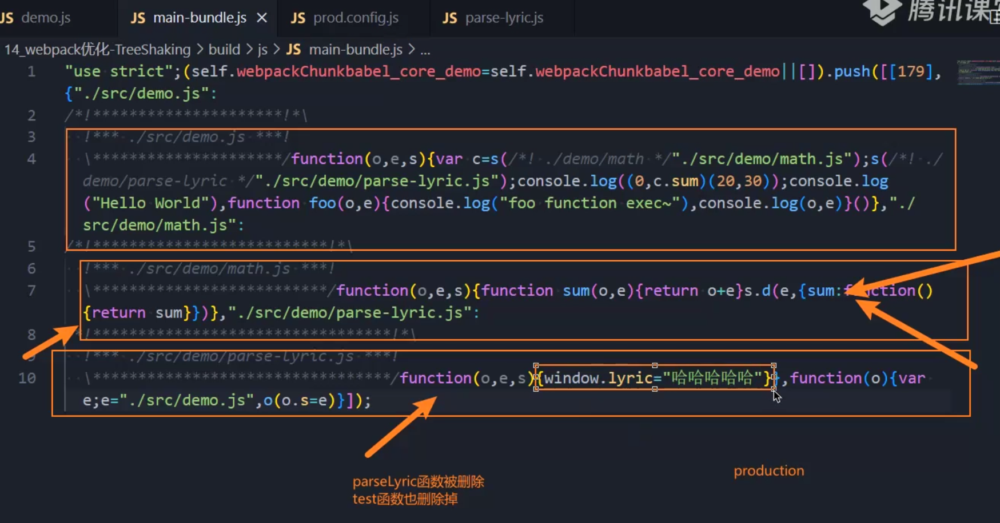
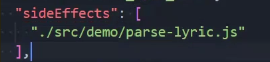
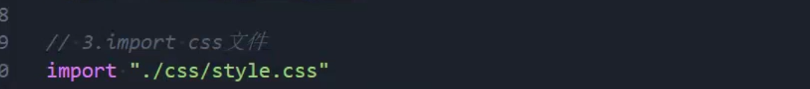
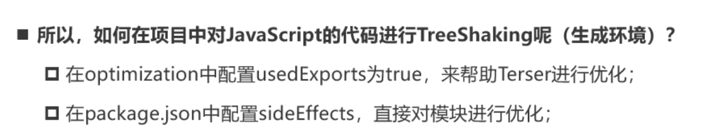

# Tree shaking

tree shaking源自于打包工具rollup，依赖于ES Module的静态编译阶段的语法分析。

webpack实现Tree Shaking采用了两种不同的方案： 

- usedExports：通过标记某些函数是否被使用，之后通过Terser来进行优化的；
- sideEffects：跳过整个模块/文件，直接查看该文件是否有副作用；

## JS的tree-shaking

### usedExports

usedExports可以结合TerserPlugin来使用的。

```js

  // 优化配置
  optimization: {
    // 导入模块时，usedExports会分析模块中哪些函数有被使用到，哪些函数没有被使用到
    // 但是这里需要注释掉minize代码部分，才能看到对应的未引用说明的注释
    // 设置为false时，外部引入未使用的函数是不会被删掉的
    usedExports: true, //tree shaking 生产环境默认自动开启
	......
    ......   
    minimize: true,
    minimizer: [
      new TerserPlugin({
        extractComments: false, //不生成LICENSE.txt文件
        terserOptions: {
          compress: {
            arguments: true
          },

          mangle: true,
          // 压缩变量名
          // toplevel: false
          // 保留函数名
          keep_fnames: true
        }
      }),
      new CSSMinimizerPlugin({})
    ]
 
  },
```

1.将mode设置为development模式： 

为了可以看到 usedExports带来的效果，我们需要设置为 development 模式 

因为在 production 模式下，webpack默认的一些优化会带来很大的影响。 

2.假设mul被定义但没有被导出使用，设置usedExports为true和false对比打包后的代码： 





在usedExports设置为true时，会有一段注释：unused harmony export mul； 

这段注释的意义是什么呢？告知Terser在优化时，可以删除掉这段代码； 



3.这个时候，我们讲 minimize设置true： 

usedExports设置为false时，mul函数没有被移除掉； 

usedExports设置为true时，mul函数有被移除掉； 

所以，usedExports实现Tree Shaking是结合Terser来完成的。

### sideEffects

sideEffects用于告知webpack compiler哪些模块存在副作用。

**主要针对 `import ""` 静态编译阶段导入的内容。**

不启用sideEffects(为true)的时候，对于这种在文件里面声明全局变量的副作用代码，webpack不敢随便删除整个根本没有应用的导出模块。

**所以我们尽量不要去写任何副作用代码！尽量编写纯模块/纯函数代码！**



所以我们需要在package.json里面配置sideEffects，只要将其设置为false，就是告知webpack可以安全删除没有应用地有副作用的exports：

```json
{
  "name": "babel_core_demo",
  "version": "1.0.0",
  "sideEffects": false,
  ......
  ......
}
  ......
  ......

```

我们也可以指定哪些文件可能存在副作用代码不需要进行tree-shaking，其它代码都会进行tree-shaking:



#### css文件的应用



实际上我们引入css文件都是存在副作用的，应该不需要进行tree-shaking，故我们可以做以下设置：

```
{
  "name": "babel_core_demo",
  "version": "1.0.0",
  "sideEffects":  [
    "*.less"
  ],
  ......
  ......
}
  ......
  ......

```



## CSS的tree-shaking

常规情况下，标签选择器不做tree-shaking。

css的tree-shaking需要借助开发时依赖的插件完成：

`npm install purgecss-webpack-plugin -D`

`pnpm add glob -D`

这个插件配置在生产环境配置里面，因为只有打包才用得上。

在prod.config.js进行配置，可以通过safelist来设置白名单选取哪些不需要设置tree-shaking的标签/类/id：

```js
// glob用于匹配某个文件夹下所有的文件
//  pnpm add glob -D
const glob = require("glob");
// css的tree-shaking
const { PurgeCSSPlugin } = require("purgecss-webpack-plugin");
......
......
  plugins: [
    // 完成css代码的抽离
    new MiniCssExtractPlugin({
      filename: "css/[name].css",
      chunkFilename: "css/[name].css"
    }),
      
    // 对CSS进行TreeShaking,去除未做应用的CSS样式
    new PurgeCSSPlugin({
      // 获取/src目录下的所有文件
      // nodir：no directory 说明需要遍历的文件不包含文件夹
      paths: glob.sync(`${path.resolve(__dirname, "../src")}/**/*`, { nodir: true })
      // 白名单设置
      // safelist: function () {
      //   return {
      //     standard: ["body"]
      //   };
      // }
    })
  ]
```

