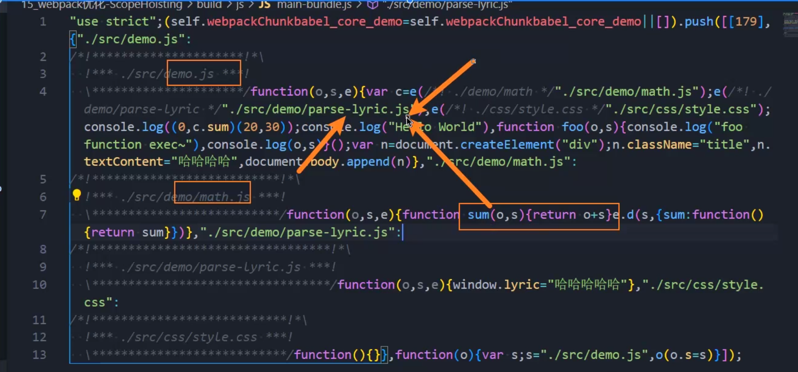

# scope-hoisting

顾名思义，这个wepack里面内置的模块可以实现作用域提升。



将其余模块的代码提升到作用域顶部，提高运行效率。

在prod.config.js里面进行如下配置：

```js
const webpack = require("webpack");
...
...
  plugins: [
    // 作用域提升,会分析哪些模块作用域可以进行提升
    /* demo示例就是把math里面的sum直接提升到导入的demo中进行调用 */
    // 如果在production模式下，会自动开启ModuleConcatenationPlugin，无需手动设置
    new webpack.optimize.ModuleConcatenationPlugin()
  ]
```

