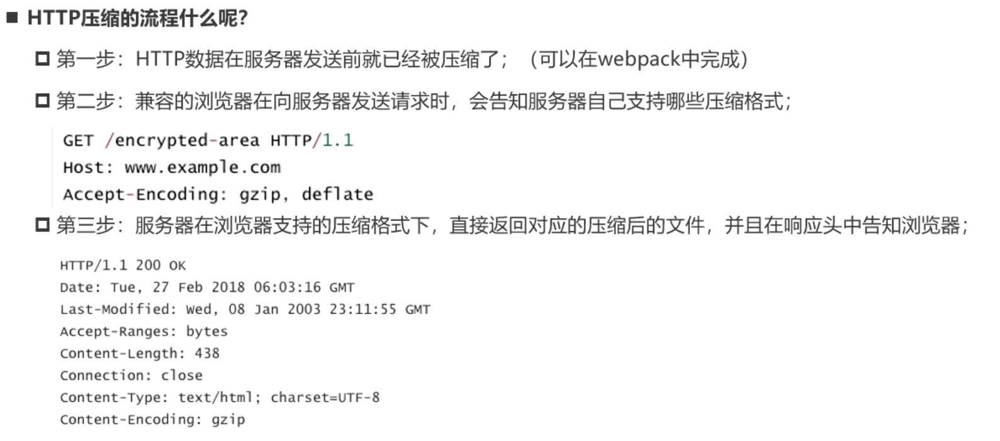

# HTTP压缩


HTTP压缩是内置在服务器和客户端之间，以改进传输速度和带宽利用率的方式。



# webpack对文件的压缩

webpack压缩是HTTP压缩的第一步，使用compression-webpack-plugin

`pnpm add compression-webpack-plugin -D`

```JS
const CompressionPlugin = require("compression-webpack-plugin");
......
......
  plugins: [
	......
    ......
    // 对打包后的文件(js/css/html)进行压缩
    new CompressionPlugin({
      test: /\.js$|\.css$/,
      // minRatio:0.8, 此项为压缩比例最小值，压缩结果大于该值才会压缩，默认值是0.8，默认自动启用该数值
      algorithm:"gzip"
    })
  ]
```

test应用正则表达式来匹配需要压缩的文件格式。

algorithm代表压缩的格式。

如果这里css没有压缩，那么就代表了css文件实在是太小了，对应的minRatio配置选项就代表了压缩比例最小值，很明显css的文件没有大于这个最小值。

## HTML的压缩

```js
  plugins: [
    new HtmlWebpackPlugin({
      template: "./index.html",
      // 二次生成的html内容变化才进行重新压缩
      cache: true,
      minify: isProduction
        ? {
            //移除注释
            removeComment: true,
            // 移除空的属性(设置为空字符串，比如class="")
            removeEmptyAttributes: true,
            // 移除多余的配置属性
            removeRedundantAttributes: true,
            // 移除空行(空白字符)
            collapseWhitespace: true,
            // 压缩html内部内联的css(去除空行)
            minifyCSS: true,
            // 压缩JS
            minifyJS: {
              mangle: {
                toplevel: true
              }
            }
          }
        : false
    }),
   ]
```

HtmlWebpackPlugin的minify选项控制了是否进行html的压缩。