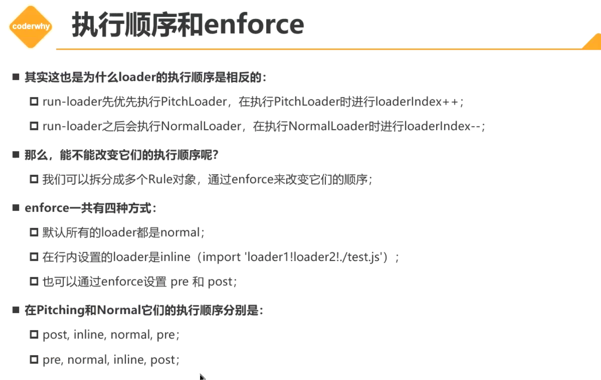

# 创建自己的loader

## loader的本质

loader是用于对模块的源代码进行转化和处理(比如babel-loader)。

1. loader的本质是一个导出为函数的JS模块。
2. loader runner库会调用这个函数，然后将上一个loader产生的结果或者资源文件传进去。

举例：

```js
// content:入口文件的输出内容
// map指的是source-map
module.exports = function (content, map) {
  console.log("hy_loader01:" + content);
  return content;
};
```

### loader的传参

#### content

如果webpack.config.js对应文件的loader use以数组的形式定义了多个处理loader，执行顺序是**从后往前(或者从右往左)**执行的，前一个loader可以通过content获取后一个loader传递过来的参数。

#### map

map就是原始数据。

## 定义loader的路径

我们可以通过resolveLoader来指定loader的加载路径，它可以用数组的形式来指定加载loader文件目录的路径。

```js
const path = require("path");
module.exports = {
  mode: "development",
  entry: "./src/main.js",
  output: {
    path: path.resolve(__dirname, "./build"),
    filename: "bundle.js"
  },
  // resolveLoader:指定loader的解析路径
  resolveLoader: {
    modules: ["node_modules", "./custom-loaders"]
  },
};
```

resolveLoader默认存入node_modules，导致rules的use配置会默认查找node_modules，使得自定义loader还需要写绝对路径的地址。

所以我们需要自己搭建一个目录，使得loader的查找有多一个索引目录，从而简化代码的书写长度

### 路径书写方式

这里的路径控制和context相关，所有写"./"都代表了根路径。而entry或者rules的路径和context相关，这个无需配置，默认是根路径。


## pitchLoader的优先执行



pitchLoader会优先执行，如果有多个loader文件，那么会优先扫描多个loader文件，然后webpack的loader会集中先执行这批pitchLoader，执行顺序和loader默认执行顺序相同。

```js
// content:入口文件的输出内容
// map指的是source-map
module.exports = function (content, map) {
  console.log("hy_loader01:" + content);
  return content;
};
 module.exports.pitch = function () {
  console.log("load pitch 01");
};
```

### enforce

可以通过单独设置enforce为"pre"来单独控制优先执行。

```js
  module: {
    rules: [
      /* 通过enforce来改变loader的执行顺序 */
            {
        test: /\.js$/,
        use: "hy_loader01"
      }, 
      {
        test: /\.js$/,
        use: "hy_loader02",
        enforce: "pre"
      },
      {
        test: /\.js$/,
        enforce: "post",
        use: "hy_loader03"
      } 
    ]
  }
```

## loader的异步处理

可以理解为多个loader产生的函数的依次调用，content会作为继承参数被传递进去。

同步loader里面无法执行异步操作，一旦存在异步返回，那么后面执行的loader无法获取前一个同步loader的执行结果。

当然，我们也可以通过callback来进行调用，但是我们需要通过异步等待的方法来获取callback的结果，那么我们需要采用this.async()，而不是this.callback()。

### 同步loader里面处理异步返回

loader之间通过callback来传递参数，callback第一个参数代表错误处理，第二个则是传递内容。

同步的loader所见即所得，那么我们该如何处理异步loader呢？见如下：

**loader2**

this.async()相当于告知webpack在执行这个JS文件的转换时，不要急于同步返回数据，而是等待这个async callback执行的时候再进行返回。

```js
// map指的是source-map

// 耗时操作
module.exports = function (content, map) {
  // const callback=this.callback;
  const callback = this.async();
  // this.async会默认等待调用callback的地方执行，所以会先通知该loader先不要返回参数，等待callback的执行
  // 异步操作
  // 如果使用const callback=this.callback;那么该代码的后续函数不会等待定时器结束，而是默认 return undefined
  setTimeout(() => {
    console.log("hy_loader02:" + content);
    callback(null, content + "bbb");
  }, 1000);
};

```

**loader3**

```js
// map指的是source-map

// 耗时操作
module.exports = function (content, map) {
  /**
   * 在 Webpack Loader 中，每一个 Loader 都会接收到一个 this 上下文对象，
   * 通过该对象可以访问到 Loader 的一些方法和属性，包括 this.callback。
   * this.callback 是一个由 Webpack 提供的用于返回处理结果的函数。
   * 它是一个用于传递处理后的内容给下一个 Loader 或 Webpack 的函数。
   */

  // 直接调用callback依然执行同步操作，所以针对setTimeout的异步执行没有效果
  // const callback = this.callback;
  // this.async()是一个异步操作的执行函数，返回一个callback函数
  /* 在 Loader 中，有些操作是异步的，比如读取文件、发送网络请求等。
     如果你的 Loader 需要执行异步操作，
     可以使用 this.async() 方法获取一个用于传递结果的回调函数。 */
  const callback = this.async();
  // 异步操作
  // 该代码的后续函数不会等待定时器结束，而是默认 return undefined
  setTimeout(() => {
    console.log("hy_loader03:" + content);
    callback(null, content + "aaa");
  }, 2000);

  //callback进行调用：
  // 参数一：错误信息，这里没有直接设置为null
  // 参数二：传递给下一个loader的内容
  // callback(null, "哈哈哈哈哈");
};

```

## 配置loader的options

现在webpack.config.js里面设置options

```js
  module: {
    rules: [
      {
        test: /\.js$/,
        use: [
          // 给Loader传递参数
          {
            loader: "hy_loader04",
            options: {
              name: "why",
              age: 18
            }
          }
        ]
      }
    ]
  }
};
```

在文件中接收options传递的参数：

```js
module.exports = function (content) {
  // 1.获取使用loader时传入的options(参数)
  // 通过this.getOptions()直接获取参数
  const options = this.getOptions();
  console.log(options);
  return content;
};

```

### 校验传递的参数

首先安装校验插件

`pnpm add schema-utils -D`

然后在具体文件中使用这个校验函数：

```js
const { validate } = require("schema-utils");
const loader04Schema = require("./schema/loader04_schema.json");
module.exports = function (content) {
  // 1.获取使用loader时传入的options(参数)
  // 通过this.getOptions()直接获取参数
  const options = this.getOptions();
  console.log(options);
  // 2.校验参数是否符合规则
  // validate(校验规则，options)
  validate(loader04Schema, options);
  console.log("hy-loader04:", content);
  return content;
};

```

另外配置校验规则的 json文件：

```json
{
    //定义整个数据类型为对象类型
  "type": "object",
    //定义对象属性
  "properties": {
    "name": {
      "type": "string",
        //用户报错提示
      "description": "请输入名称并且是字符串类型"
    },
    "age": {
      "type": "number",
        //用户报错提示
      "description": "请输入年龄并且是数字类型"
    }
  }
}
```

在pnpm run build的时候，会得到校验效果的提示(如果报错的话)。