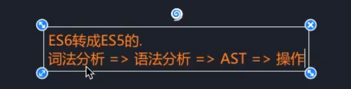
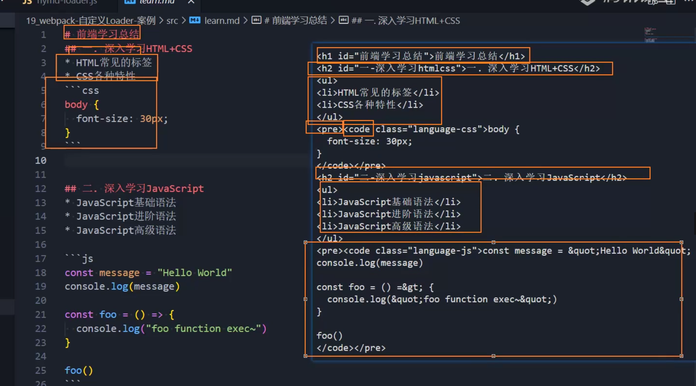

# 自己编写一个类babel-loader

babel-loader编译的流程解析：



**思路：我们自行创建一个babel-loader，但是没必要手写一个babel，我们可以借助第三方工具来实现一个简易的babel-loader。**

## 实现流程：

1.安装babel-core插件

`pnpm add @babel/core -D`

2.先在webpack.config.js里面配置自定义loader：

```js
module.exports = {
  mode: "development",
  devtool: false,
  entry: "./src/main.js",
  output: {
    path: path.resolve(__dirname, "./build"),
    filename: "bundle.js"
  },
  // resolveLoader:指定loader的解析路径
  resolveLoader: {
    modules: ["node_modules", "./hy-loaders"]
  },
  module: {
    rules: [
      {
        test: /\.jsx?$/,
        use: [
          {
            loader: "hybabel-loader"
          }
        ]
      }
};

```

3.在文件中使用babel来实现代码的转换：

```js
const babel = require("@babel/core");
const { validate } = require("schema-utils");
const babelSchema = require("../schema/babel_schema.json");
// 动态地通过本地babel.config.js文件来配置babel
module.exports = function (content) {
  // 使用异步loader,利用babel的transform来转化代码
  // 本质上this.async()就是一个异步回调版的this.callback。
  const callback = this.async();
  babel.transform(content, {}, (err, result) => {
    if (err) {
      callback(err);
    } else {
      callback(null, result.code);
    }
  });
  //   return content;
};

```

### babel.transform

用babel.transform来对代码内容进行转换，具体代码见上图，第一个参数是代码内容，第二个参数是可选的相关选项，第三个参数是错误处理。

注意不要在这份代码里面写**return content**，而是在错误处理里面的else判断中，通过callback将转换结果传递给下一个loader，如果没有loader就传递给webpack生成打包代码。

### babel options的应用

```js
module.exports = {
  mode: "development",
  devtool: false,
  entry: "./src/main.js",
  output: {
    path: path.resolve(__dirname, "./build"),
    filename: "bundle.js"
  },
  // resolveLoader:指定loader的解析路径
  resolveLoader: {
    modules: ["node_modules", "./hy-loaders"]
  },
  module: {
    rules: [
      {
        test: /\.jsx?$/,
        use: [
          {
            loader: "hybabel-loader",
            // options的内容会在对应的loader中去读取
            options: {
              presets: ["@babel/preset-env"]
            } 
          }
        ]
      }
};

```

我们通过在config配置里面传进一个options帮助我们对babel进行转化工作，options里面写入的相关plugins或者presets。

我们通过在文件里面的this.getOptions()获取传递过来的options:

```JS
const babel = require("@babel/core");
const { validate } = require("schema-utils");
const babelSchema = require("../schema/babel_schema.json");
// 动态地通过本地babel.config.js文件来配置babel
module.exports = function (content) {
  // 使用异步loader,利用babel的transform来转化代码
  // 本质上this.async()就是一个异步回调版的this.callback。
  const callback = this.async();
  // 获取options
  let options = this.getOptions();
  babel.transform(content, options, (err, result) => {
    if (err) {
      callback(err);
    } else {
      callback(null, result.code);
    }	
  });
  //   return content;
};

```

如此一来再进行pnpm run build打包，打包后的文件内容就完成了babel的转化操作。

### babel options独立配置

如果我们想通过独立文件的形式配置babel options，我们先在webpack.config.js里面的options配置为空(或者plugins配置为空)。

然后在JS代码文件里面判定options是否为空，最后独立建立一个babel.config.js文件，用于作为babel options的配置文件。

**define-loader.js**

```js
const babel = require("@babel/core");
const { validate } = require("schema-utils");
const babelSchema = require("../schema/babel_schema.json");
// 动态地通过本地babel.config.js文件来配置babel
module.exports = function (content) {
  // 使用异步loader,利用babel的transform来转化代码
  // 本质上this.async()就是一个异步回调版的this.callback。
  const callback = this.async();
  // 获取options
  let options = this.getOptions();
  if (!Object.keys(options).length) {
    // 导入options
    options = require("../babel.config");
  }
  // 校验options
  validate(babelSchema, options);
  // 传参内容：源代码，配置，回调函数
  /**
   * babel.transform(content, options, (err, result) => { ... });:
   * 这是一个异步操作，它使用 babel.transform 方法来对源代码 content 进行转换，
   * 使用传递给 Loader 的选项 options。
   * 异步回调：
   * 在 babel.transform 的回调函数中，
   * 处理了可能发生的错误和转换后的结果。如果发生错误，就调用 callback(err) 将错误传递给 Webpack，
   * 否则调用 callback(null, result.code) 将转换后的代码传递给 Webpack。
   */
  babel.transform(content, options, (err, result) => {
    if (err) {
      callback(err);
    } else {
      callback(null, result.code);
    }
  });
  //   return content;
};


```

**babel.config.js**

```js
module.exports = {
    presets: ["@babel/preset-env"]
}
```

## markdown类型loader

1.先在webpack.config.js里面配置md解析的loader，同时我们需要index.html来正常展示md的内容，所以我们需要应用HtmlWbpackPlugin插件。

```js
const path = require("path");
const HtmlWbpackPlugin = require("html-webpack-plugin");

module.exports = {
  mode: "development",
  devtool: false,
  entry: "./src/main.js",
  output: {
    path: path.resolve(__dirname, "./build"),
    filename: "bundle.js"
  },
  // resolveLoader:指定loader的解析路径
  resolveLoader: {
    modules: ["node_modules", "./hy-loaders"]
  },
  module: {
    rules: [
      {
        // pnpm add marked =>md文档的解析
        test: /\.md$/,
        use: {
          loader: "hymd-loader"
        }
      }
    ]
  }
plugins: [new HtmlWbpackPlugin()]

};

```

2.安装插件处理md文件

`pnpm add marked -D`

3.在md转化文件里面处理md文件内容

```js
// pnpm add marked -D=>md文档的解析
const { marked } = require("marked");
const hljs = require("highlight.js");
module.exports = function (content) {
    //将md语法转化为html元素结构
const htmlContent=marked(content)
const innerContent="`"+htmlContent+"`";
  // 将变量code的值作为默认导出的内容
  const moduleContent = `var code=${innerContent};export default code`;
  return moduleContent;
};

```



### 正确导出md转化代码

通过marked转化后的md的代码不能直接导出，因为webpack强制必须要求模块化的内容。所以我们需要通过以下格式化操作将其导出，这样才能变成webpack能识别的代码：

```js
 const moduleContent = `var code=${innerContent};export default code`;
  return moduleContent;
```

### 在引入md内容文件中正确应用

**main.js**

```js
// md文件被解析完成后，生成代码，从而可以正确获取code
import code from "./doc.md";
......
......
//将md被转换后的代码写入到HTML页面之中
document.body.innerHTML = code;

```

结合HtmlWbpackPlugin插件，我们通过document.body.innerHTML(注意必须是innerHTML)来展示内容，最后我们可以在打包文件里面正常浏览md文件啦~

### 优化展示内容

我们需要利用css来美化md的输出页面结果，所以需要在webpack配置文件里面写入解析css文件的配置loader。

```js
const path = require("path");
const HtmlWbpackPlugin = require("html-webpack-plugin");
module.exports = {
  mode: "development",
  devtool: false,
  entry: "./src/main.js",
  output: {
    path: path.resolve(__dirname, "./build"),
    filename: "bundle.js"
  },
  // resolveLoader:指定loader的解析路径
  resolveLoader: {
    modules: ["node_modules", "./hy-loaders"]
  },
  module: {
    rules: [
      {
        test: /\.css$/,
        use: ["style-loader", "css-loader"]
      },
      {
        // pnpm add marked =>md文档的解析
        test: /\.md$/,
        use: {
          loader: "hymd-loader"
        }
      }
    ]
  },
  plugins: [new HtmlWbpackPlugin()]
};

```

**code.css**

```css
pre {
  background-color: #f2f2f2;
  padding: 15px;
  margin: 20px;
}
.hljs-keyword{
    color:red
}
.hljs-string{
    color:blue
}
```

#### 高亮md文件内容中的关键字

1.首先安装高亮字插件

`pnpm add highlight.js -D`

2.在loader文件里面引入高亮字插件，然后通过marked.setOptions配置高亮关键字，将其作为marked的配置选项。

code是代码，lang是代码的语言。

我们可以在css文件(见上面)里面写入hljs关联的类控制器的css样式,也可以在`main.js`引入hightlight提供的css库一次性解决样式问题。


```js
// pnpm add marked -D=>md文档的解析
const { marked } = require("marked");
const hljs = require("highlight.js");
module.exports = function (content) {
	marked.setOptions({
    	highlight: function (code,lang) {
      // 传参类型:语言,代码
     	 return hljs.highlight(code,{lang}).value;
    	}
  	});
  // 将md语法转化成html的元素结构
  const htmlContent = marked(content);
  // 返回的结果必须是模块化的内容
  // 先转换为字符串形式
  const innerContent = "`" + htmlContent + "`";
  // 再转化为JavaScript代码
  const moduleContent = `var code=${innerContent};export default code`;
  return moduleContent;
};
```


```js
const babel = require("@babel/core");
const { validate } = require("schema-utils");
const babelSchema = require("../schema/babel_schema.json");
// 动态地通过本地babel.config.js文件来配置babel
module.exports = function (content) {
  // 使用异步loader,利用babel的transform来转化代码
  // 本质上this.async()就是一个异步回调版的this.callback。
  const callback = this.async();
  // 获取options
  let options = this.getOptions();
  if (!Object.keys(options).length) {
    // 导入options
    options = require("../babel.config");
  }
  // 校验options
  validate(babelSchema, options);
  // 传参内容：源代码，配置，回调函数
  /**
   * babel.transform(content, options, (err, result) => { ... });:
   * 这是一个异步操作，它使用 babel.transform 方法来对源代码 content 进行转换，
   * 使用传递给 Loader 的选项 options。
   * 异步回调：
   * 在 babel.transform 的回调函数中，
   * 处理了可能发生的错误和转换后的结果。如果发生错误，就调用 callback(err) 将错误传递给 Webpack，
   * 否则调用 callback(null, result.code) 将转换后的代码传递给 Webpack。
   */
  babel.transform(content, options, (err, result) => {
    if (err) {
      callback(err);
    } else {
      callback(null, result.code);
    }
  });
  //   return content;
};

```


`babel.transform` 是一个异步操作，因为它可能会涉及到耗时的任务，比如解析大量的代码、应用转换规则等。在处理大规模的代码时，这个过程可能会花费一定的时间。

如果 `babel.transform` 是一个同步操作，它将会阻塞整个 Webpack 构建过程，直到转换完成才会继续往下执行。这将导致构建过程变得非常缓慢，特别是当处理大量代码时。

因此，`babel.transform` 被设计成一个异步函数，允许它在后台执行转换过程，而不会阻塞 Webpack 的构建。这样，其他任务可以在转换进行的同时继续执行。

异步操作的常见例子包括文件读取、网络请求、定时器等，它们都需要一定的时间来完成。在这段代码中，`babel.transform` 可能需要一些时间来对源代码进行转换，因此它是一个异步操作。