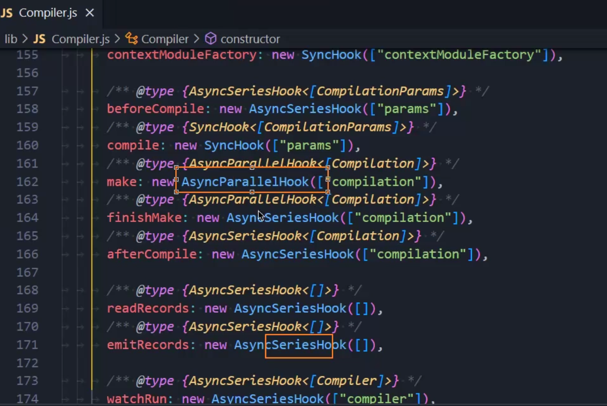
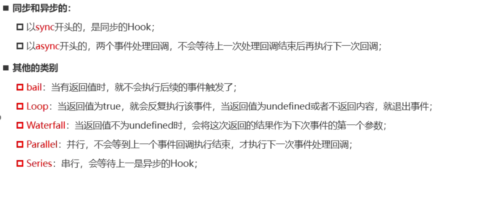
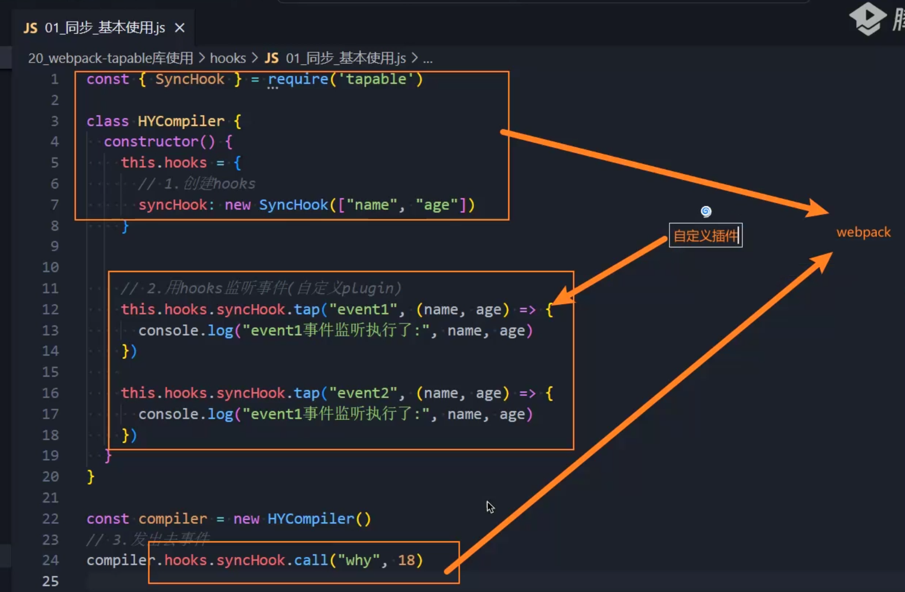
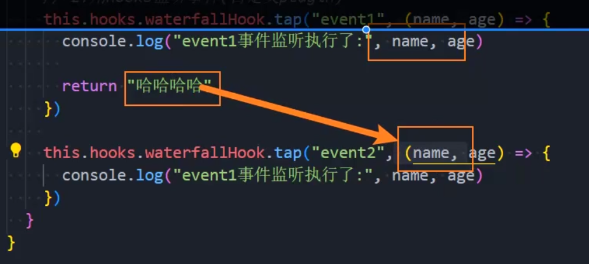

# Tapable

webpack官方出品的管理hook的库，我们需要独立安装：

`pnpm add tapable`

webpack底层的compiler就是利用Tapable的各类hooks来完成各种plugins不同生命阶段的监听任务。



### 同步和异步

以sync开头的，是同步的hook

以async开头的，两个事件处理回调，不会等待上一次处理回调结束后再执行下一次回调




同步(sync)和异步(async)可以结合其它特性关键字，生成对应特性的hook，见下面的标题详解。

# 同步关键字

## SyncHook

我们从tapable里面导入基础同步型的SyncHook，然后可以直接定义在一个类中。



一般发射事件和定义hooks都是webpack来完成的，而监听事件是我们自己来定义的。

我们可以先用SyncHook来监听一个事件( ` this.hooks.syncHook.tap`  )，然后再利用 `compiler.hooks.syncHook.call`来发射一个事件。

发射一个事件可以让多个监听器监听到。

```js
const { SyncHook } = require("tapable");
// SyncHook 是 tapable 库提供的一种钩子类型，
// 它是同步钩子，可以用于在特定的时机执行注册的回调函数。
class HYCompiler {
  constructor() {
    //   1.创建hooks
    this.hooks = {
      /* 创建了一个 hooks 对象，并在其中定义了一个名为 syncHook 的钩子。
        这个钩子接受两个参数，
        分别是 "name" 和 "age"，用于在调用钩子时传递参数。 */
      // 这里数组传参决定了在回调该hook的时候，可以给该hook传递哪些参数
      syncHook: new SyncHook(["name", "age"])
    };

    // 2.利用hooks监听事件(自定义plugin)
    // tap用于监听事件，第一个参数是插件名，第二个参数是回调函数
    /* 这段代码会将一个名为 "event1" 的监听器注册到 syncHook 钩子上，
    当调用 syncHook 时(下面的发射事件代码)，会执行回调函数，并传递相应的参数 name 和 age。 */
    this.hooks.syncHook.tap("event1", (name, age) => {
      console.log("event1事件监听已执行：", name, age);
    });
    this.hooks.syncHook.tap("event2", (name, age) => {
      console.log("event2事件监听已执行：", name, age);
    });
  }
}

const compiler = new HYCompiler();
// 3.发射事件
// 这里无需传事件名称，只需要传参数，此处一经触发，立刻调用上面的tap监听事件
compiler.hooks.syncHook.call("zhangsan", 18);

```


## SyncBailHook

一旦使用BailHook，第一个监听事件一旦存在返回值，那么可以阻断后续的监听事件继续执行(常用于出现错误抛出错误，中止后续监听事件的执行)。

```js
const { SyncBailHook } = require("tapable");

class HYCompiler {
  constructor() {
    //   1.创建hooks
    this.hooks = {
      bailHook: new SyncBailHook(["name", "age"])
    };

    // 2.利用hooks监听事件(自定义plugin)

    this.hooks.bailHook.tap("event1", (name, age) => {
      console.log("event1事件监听已执行：", name, age);
        //有返回值，监听到此结束，再见
      return 123;
    });
    this.hooks.bailHook.tap("event2", (name, age) => {
      console.log("event2事件监听已执行：", name, age);
    });
  }
}

const compiler = new HYCompiler();
// 3.发射事件
compiler.hooks.bailHook.call("zhangsan", 18);

```

bailhook的第一个监听事件如果里面有返回值，那么后续事件将不再执行

## SyncLoopHook

一旦使用SyncLoopHook，第一个监听事件一旦存在为true的返回值，那么这个事件就会一直执行，直到返回undefined等false值执行才结束，退出本次监听，不再继续向下执行。

```js
const { SyncLoopHook } = require("tapable");
let count = 0;
class HYCompiler {
  constructor() {
    //   1.创建hooks
    this.hooks = {
      loopHook: new SyncLoopHook(["name", "age"])
    };

    // 2.利用hooks监听事件(自定义plugin)

    this.hooks.loopHook.tap("event1", (name, age) => {
      if (count < 5) {
        console.log("event1事件监听已执行：", name, age);
        count++;
        return true;
      }
      // return 123=>boolean=>true
    });
    this.hooks.loopHook.tap("event2", (name, age) => {
      console.log("event2事件监听已执行：", name, age);
    });
  }
}

const compiler = new HYCompiler();
// 3.发射事件
setTimeout(() => {
  compiler.hooks.loopHook.call("zhangsan", 18);
}, 1500);

```

监听事件回调函数的返回值为true时，循环执行该回调函数

## SyncWaterFallHook

如果存在返回值，那么这个返回值将作为下一个监听事件回调函数的第一个传参。

```js
const { SyncWaterfallHook } = require("tapable");
let count = 0;
class HYCompiler {
  constructor() {
    //   1.创建hooks
    this.hooks = {
      waterfallHook: new SyncWaterfallHook(["name", "age"])
    };

    // 2.利用hooks监听事件(自定义plugin)

    this.hooks.waterfallHook.tap("event1", (name, age) => {
      console.log("event1事件监听已执行：", name, age);
      // 返回的值存在时，将作为下一个监听事件回调函数的第一个传参。
      return "哈哈哈哈哈";
    });
    this.hooks.waterfallHook.tap("event2", (name, age) => {
      console.log("event2事件监听已执行：", name, age);
    });
  }
}

const compiler = new HYCompiler();
// 3.发射事件
setTimeout(() => {
  compiler.hooks.waterfallHook.call("zhangsan", 18);
}, 1500);

```



# 异步关键字

## AsyncParallelHook

事件发射以后，两个监听事件并发执行。

```JS
const { AsyncParallelHook } = require("tapable");
let count = 0;
class HYCompiler {
  constructor() {
    //   1.创建hooks
    this.hooks = {
      parallelHook: new AsyncParallelHook(["name", "age"])
    };

    // 2.利用hooks进行异步监听
    /* 这两个异步事件不会产生阻塞，而是以并行的方式同步执行 */
    this.hooks.parallelHook.tapAsync("event1", (name, age) => {
      setTimeout(() => {
        // 异步操作
        console.log("event1事件监听已执行：", name, age);
      }, 3000);
    });
    this.hooks.parallelHook.tapAsync("event2", (name, age) => {
      setTimeout(() => {
        // 异步操作
        console.log("event2事件监听已执行：", name, age);
      }, 4000);
    });
  }
}

const compiler = new HYCompiler();
// 3.发射事件
setTimeout(() => {
  // 事件一经发射，立刻开始执行hooks监听事件
  compiler.hooks.parallelHook.callAsync("zhangsan", 18);
}, 0);

```

## AsyncSeriesHook

异步地执行完第一个任务以后，再异步执行第二个参数。

我们需要用callback()来推进下一个监听事件的执行，第二个监听事件的第三个形参应该作为callback来接收上一次监听事件的执行回调。

第二个监听事件的执行必须等待第一个监听事件的callback()执行才能被调用。

最后会回到发射事件的回调函数，整个过程才算完成。


利用callback来串行执行对应的回调函数，属于层层串连的回调执行。

最后执行的就是调用钩子的callAsync函数的回调函数，代表所有回调执行完毕。

