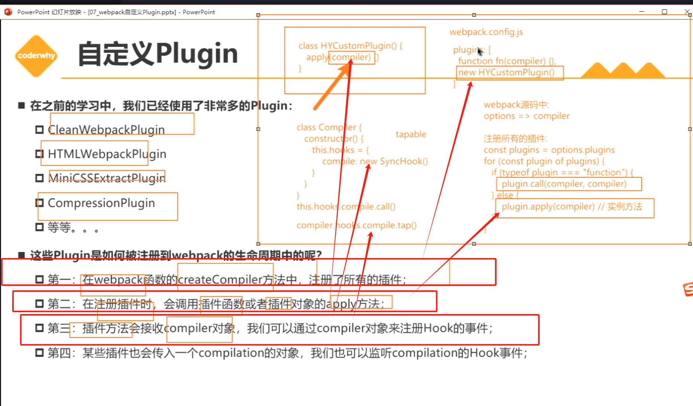
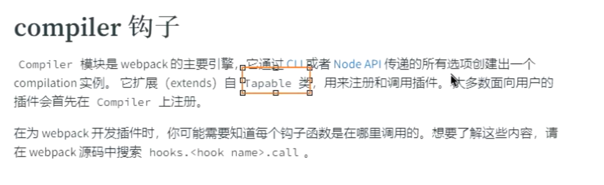
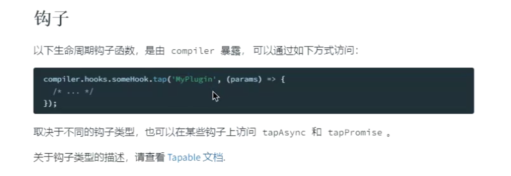
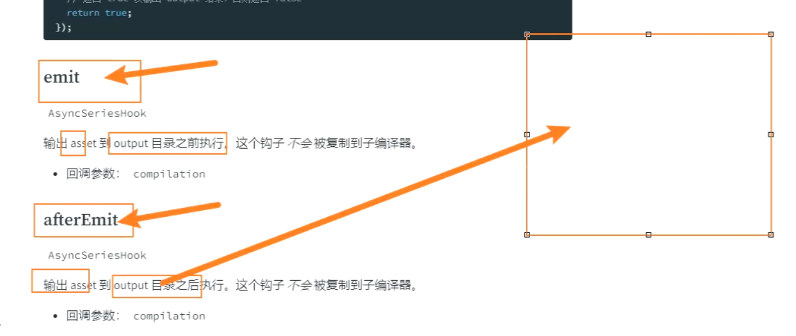
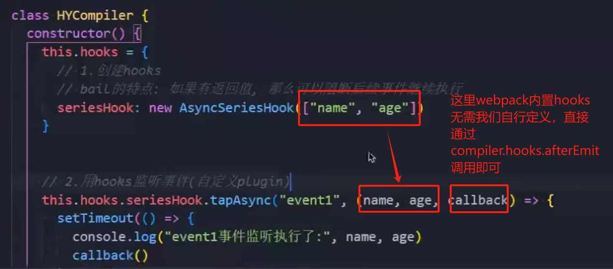

# 自定义Plugin

plugin如何被注册到webpack的生命周期之中的呢？

1. 在webpack函数的createCompiler方法中，注册了所有的插件。
2. 在注册插件时，会调用插件函数或者插件对象的apply方法。
3. 插件方法会接收compiler对象，通过compiler对象来注册hook的事件。
4. 某些插件也会传入一个compilation的对象，也可以通过compilation来监听它里面的hooks对象。



##  将打包文件直接部署到远程服务器

插件的注册是通过apply()来完成的。

我们需要在webpack.config.js导入我们自定义的部署用插件

```js
const path = require("path");
const HtmlwebpackPlugin = require("html-webpack-plugin");
const AutoUploadWebpackPlugin = require("./plugins/AutoUploadWebpackPlugin");
const { PASSWORD, SERVER_HOST, USER_NAME, REMOTE_PATH } = require("./plugins/config");
module.exports = {
  mode: "production",
  entry: "./src/main.js",
  output: {
    path: path.resolve(__dirname, "./build"),
    filename: "bundle.js"
  },
  plugins: [
    new HtmlwebpackPlugin(),
    new AutoUploadWebpackPlugin({
      host: SERVER_HOST,
      username: USER_NAME,
      password: PASSWORD,
      remotePath: REMOTE_PATH
    })
  ]
};

```

### apply注册hooks监听事件

然后我们需要通过plugin插件里面写入apply(compiler){}，来帮助webpack注册hooks监听事件，等到assets已经输出到output目录上时，完成自动上传的功能。

```js
class AutoUploadWebpackPlugin {
    //插件的注册需要依赖内置的apply方法
  apply(compiler) {
    console.log("AutoUploadWebpackPlugin被注册");
  }
}
module.exports = AutoUploadWebpackPlugin;

```

我们要通过compiler来注册hooks监听事件，compiler里面集成了很多的hooks，贯穿了webpack的生命周期。(详情可以查看webpack官网的plugins-compiler钩子 )





简而言之，你想监听webpack具体某个生命周期去利用回调完成一些操作，那么你就可以调用对应生命周期的hooks。 

我们的目的是等到webpack编译内容完成后，输出内容(静态资源)并自动上传。

所以我们可以借助afterEmit，来实现assets已经输出到output目录上时，完成自动上传的功能:

**注意，这里的回调参数是compilation，除此以外还有一个默认的callback用于下一个钩子的回调"通知"，保证继续向下执行。**





### 钩子内部的操作步骤

1. 获取输出文件夹的路径(其中资源)

   通过compilation获取outputOptions这一输出对象，再从里面获取path属性获取输出文件夹

   ```js
   class AutoUploadWebpackPlugin {
       //插件的注册需要依赖内置的apply方法
     apply(compiler) {
       console.log("AutoUploadWebpackPlugin被注册");
       compiler.hooks.afterEmit.tapAsync("AutoPlugin", async (compilation, callback) => {
         // 1.获取输出的文件夹路径(其中的资源)
         const outputPath = compilation.outputOptions.path;
         console.log(outputPath);
       }
     }
   }
   ```

2. 连接远程服务器SSH

   我们需要通过安装远程连接服务器的第三方库来完成远程服务器的连接

   `pnpm add node-ssh -D`

3. 将文件夹中资源上传到服务器中

   ```JS
   const { NodeSSH } = require("node-ssh");
   class AutoUploadWebpackPlugin {
      constructor(options) {
       // pnpm add node-ssh -D
       this.ssh = new NodeSSH();
       //   options作为被传递的参数
       this.options = options;
      }
       //插件的注册需要依赖内置的apply方法
     apply(compiler) {
       console.log("AutoUploadWebpackPlugin被注册");
       compiler.hooks.afterEmit.tapAsync("AutoPlugin", async (compilation, callback) => {
         //   2.连接远程服务器SSH
         await this.connectServer();
         //   3.删除原有的文件夹内容
         const remotePath = this.options.remotePath;
         this.ssh.execCommand(`rm -rf ${remotePath}/*`);
         //   4.将文件夹中的资源上传到服务器中
         await this.uploadFiles(outputPath, remotePath);
   
         // 5.关闭ssh连接
         this.ssh.dispose();
         //   完成所有操作后需要调用callback，不理解就回头看第20章
         callback();
       });
     }
   
     async connectServer() {
       await this.ssh.connect({
         host: this.options.host,
         username: this.options.username,
         password: this.options.password
       });
       console.log("服务器连接成功");
     }
     async uploadFiles(localPath, remotePath) {
       //   将本地目录文件上传到远程服务器指定目录
       const status = await this.ssh.putDirectory(localPath, remotePath, {
         // 递归上传
         recursive: true,
         // 并发上传
         concurrency: 10
       });
       //   上传成功
       if (status) {
         console.log("文件上传服务器成功");
       }
     }
   }
   ```

   

   I.localPath是本地输出文件目录，remotePath是远程服务器目录。

   II.如果上传的文件本身内部也嵌套了文件夹，那么我们应该开启递归上传III.的方式去上传文件。

   IV.我们可以通过并发上传确定并发上传文件的数量，默认就是10。

   V.如果status存在，则代表上传服务器成功。

4. 完成所有的操作后，关闭ssh连接，调用callback()继续执行webpack的生命周期流程。

   ```js
     apply(compiler) {
       console.log("AutoUploadWebpackPlugin被注册");
       compiler.hooks.afterEmit.tapAsync("AutoPlugin", async (compilation, callback) => {
         //   2.连接远程服务器SSH
         await this.connectServer();
         //   3.删除原有的文件夹内容
         const remotePath = this.options.remotePath;
         this.ssh.execCommand(`rm -rf ${remotePath}/*`);
         //   4.将文件夹中的资源上传到服务器中
         await this.uploadFiles(outputPath, remotePath);
         // 5.关闭ssh连接
         this.ssh.dispose();
         //   完成所有操作后需要调用callback，不理解就回头看第20章
         callback();
       });
     }
   ```

5. 我们可以通过plugins的options来传递参数内容，这样就可以满足用户引用插件自定义plugins options的需求。

   ```js
   const path = require("path");
   const HtmlwebpackPlugin = require("html-webpack-plugin");
   const AutoUploadWebpackPlugin = require("./plugins/AutoUploadWebpackPlugin");
   const { PASSWORD, SERVER_HOST, USER_NAME, REMOTE_PATH } = require("./plugins/config");
   module.exports = {
     mode: "production",
     entry: "./src/main.js",
     output: {
       path: path.resolve(__dirname, "./build"),
       filename: "bundle.js"
     },
     plugins: [
       new HtmlwebpackPlugin(),
       new AutoUploadWebpackPlugin({
         host: SERVER_HOST,
         username: USER_NAME,
         password: PASSWORD,
         remotePath: REMOTE_PATH
       })
     ]
   };
   
   ```

## 总结

我们首先自定义一个plugin的JS文件，然后利用plugins的apply方法利用compiler参数来实现hooks的选型和监听操作，afterEmit就是输出打包文件后的hooks，我们利用这个hooks来监听具体的输出内容。

通过`compilation.outputOptions.path`可以获取输出的文件夹路径(其中的资源)

然后我们获取输出文件夹的路径，再连接远程服务器，清空服务器指定输出目录的原文件后，再通过自定义一个上传方法来上传资源到服务器指定输出目录，最后关闭连接执行callback()，大功告成。

注意options是可以在webpack.config.js通过plugins的options配置来传递到Plugins组件内部的。

这个plugins设计的核心在于理解apply(compiler)作为webpack plugins设定的插件注册方法，并且要结合compiler内置的afterEmit这个hooks的监听事件，去完成webpack在这个生命周期中要完成的操作。

整个plugins的设计精髓就在于apply(compiler)注册hooks，以及利用compiler里面对应生命周期的hooks去操作对应的内容。