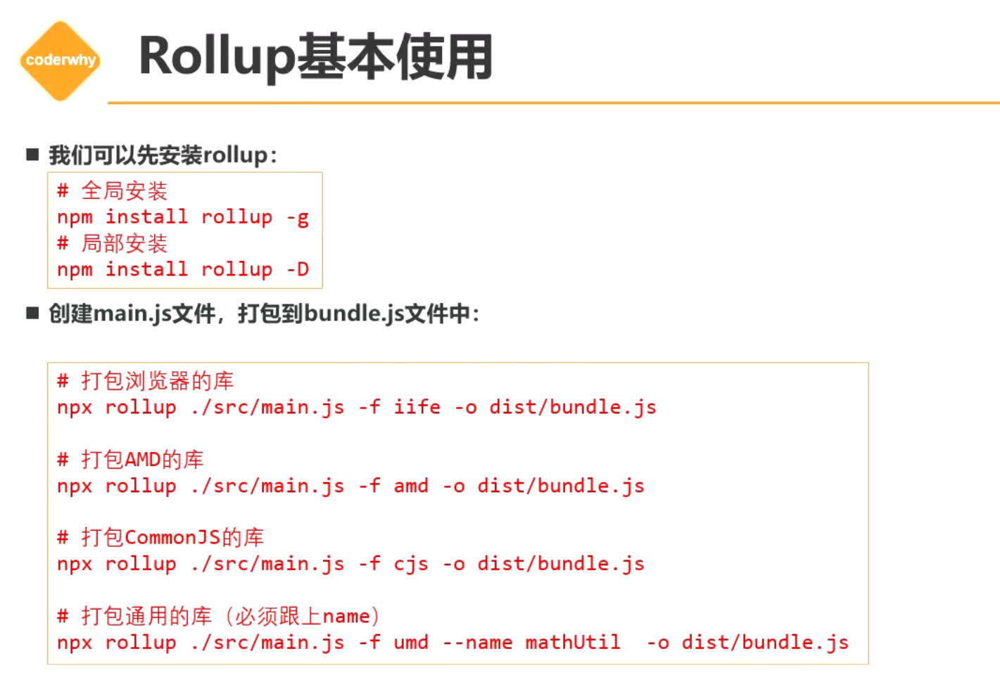
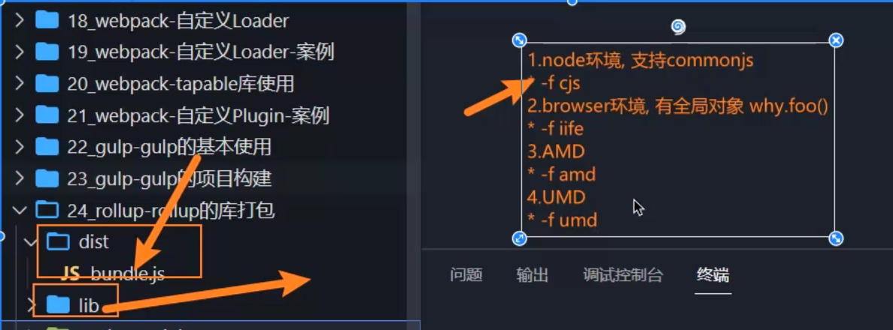
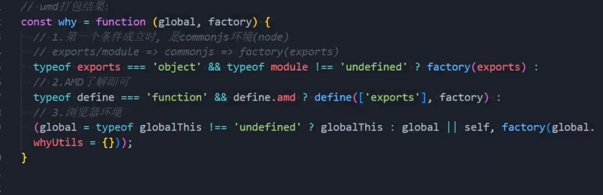

# rollup

什么是rollup?

1. Rollup也是一个模块化的打包工具，但是Rollup主要是针对ES Module进行打包的； 
2. 另外webpack通常可以通过各种loader处理各种各样的文件，以及处理它们的依赖关系； 
3. rollup更多时候是专注于处理JavaScript代码的（当然也可以处理css、font、vue等文件）； 
4. 另外rollup的配置和理念相对于webpack来说，更加的简洁和容易理解；

### 

# rollup的库打包模式

### 命令行打包

`npx rollup ./lib/index.js -o dist/bundle.js`



对应的-f后面跟着的就是对不同环境的支持，比如支持node环境应用：

`npx rollup ./lib/index.js -f cjs -o dist/bundle.js`

如果你期望利用umd社区规范在所有的环境下运行，可以运行以下命令：

``npx rollup ./lib/index.js -f umd --name whyUtils -o dist/bundle.js``



## rollup的配置文件

我们通过配置以下配置文件，在命令行输出:

`npx rollup -c`，-c代表使用对应的配置文件。下图的配置囊括了各类社区规范和环境的打包方式。

```js
//  npx rollup -c
module.exports = {
	// 入口
	input: "./libs/index.js",
	// 出口
	output: {
		// 格式：umd规范
		format: "umd",
		// 全局名称
		name: "whyUtils",
		file: "./build/bundle.umd.js",
		// // amd
		// {
		// 	// 格式
		// 	format: "amd",
		// 	file: "./build/bundle.amd.js",
		// },
		// // cjs
		// {
		// 	// 格式
		// 	format: "cjs",
		// 	file: "./build/bundle.cjs.js",
		// },
		// // iife(浏览器)
		// {
		// 	// 格式
		// 	format: "iife",
		// 	file: "./build/bundle.browser.js",
		// },
	},
};

```

### 引入第三方库

lodash默认没有被正常打包，因为它使用了commonjs进行导出，而rollup使用的是ES Module模块进行导入导出。

所以我们必须借助第三方插件才能完成这个工作：

#### plugin-commonjs

`pnpm add @rollup/plugin-commonjs -D`

然后再导入这个插件，通过应用这个plugins来解决兼容问题：

```js
	// 解决了在rollup打包文件时的commonjs兼容问题
	const commonjs = require("@rollup/plugin-commonjs");
	......
	plugins: [
		commonjs(),
		......
	]
```

这个插件可以实现commonJS形式导出，以ES Module形式导入的效果。

#### plugin-node-resolve

`pnpm add @rollup/plugin-node-resolve -D`

这个插件的作用是可以结合上面的插件在node_modules里面引入commonJS导出的第三方库。

```js
// 解决了在rollup打包文件时的commonjs兼容问题
const commonjs = require("@rollup/plugin-commonjs");
......
	plugins: [
		commonjs(),
		nodeResolve(),
        ......
	],
```

如此一来，我们就可以顺利导入lodash第三方库了。

但是如果我们设计的是一个库或者插件的话，又确实不需要对lodash进行打包，如果需要打包也应该是用户自主进行lodash的下载应用来解决问题，所以我们需要做如下配置，通过external来排除打包的插件：

```js
/* 默认lodash未被打包是因为使用了commonjs，默认rollup使用esmodule */
// 解决了在rollup打包文件时的commonjs兼容问题
const commonjs = require("@rollup/plugin-commonjs");
// 解决了在rollup打包时针对node_modules的commonjs兼容问题
const nodeResolve = require("@rollup/plugin-node-resolve");
//  npx rollup -c
module.exports = {
	// 入口
	input: "./libs/index.js",
	// 出口
	output: {
		// 格式：umd规范
		format: "umd",
		// 全局名称
		name: "whyUtils",
		file: "./build/bundle.umd.js",
		// 解决lodash没有放进打包文件的问题
		globals: {
			lodash: "_",
		},
	},
	external: ["lodash"],
	plugins: [
		commonjs(),
		nodeResolve(),
	],
};

```

### 应用babel

`pnpm add @babel/core @rollup/plugin-babel -D`

根据特殊的用法(polyfill)来控制垫片的运用，并且排除node_modules文件夹的babel转化。

```js
const { babel } = require("@rollup/plugin-babel");
module.exports = {
	// 入口
	input: "./libs/index.js",
	// 出口
	output: {
		// 格式：umd规范
		format: "umd",
		// 全局名称
		name: "whyUtils",
		file: "./build/bundle.umd.js",
	},
	plugins: [
		babel({
			babelHelpers: "bundled",
			exclude: /node_modules/,
		}),
		terser(),
	],
};

```

#### 配置babel.config.js

`pnpm add @babel/preset-env -D`

```js
module.exports={
    presets:["@babel/preset-env"]
}
```

### 应用压缩terser

`pnpm add @rollup/plugin-terser -D`

```js
const { terser } = require("rollup-plugin-terser");
//  npx rollup -c
module.exports = {
	// 入口
	input: "./libs/index.js",
	// 出口
	output: {
		// 格式：umd规范
		format: "umd",
		// 全局名称
		name: "whyUtils",
		file: "./build/bundle.umd.js"
	plugins: [
		terser()
	],
};

```

