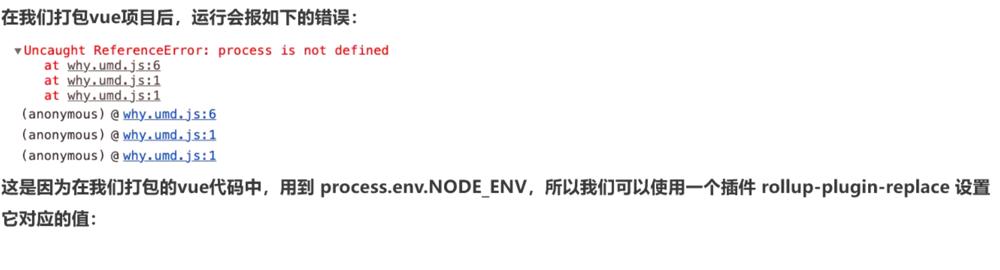
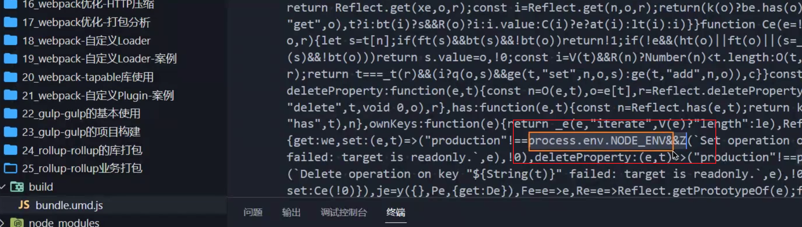

# rollup的业务打包模式

## 通过postcss来适配css文件

`pnpm add postcss  rollup-plugin-postcss -D`

**rollup.config.js**

```js
const postcss = require("rollup-plugin-postcss");
const plugins = [
	postcss()
];
module.exports = {
    ......
  plugins: plugins
}

```

##  适配浏览器前缀

`pnpm add postcss-preset-env -D`

**postcss.config.js**

```js
module.exports = {
	plugins: [require("postcss-preset-env")],
};
```

## 适配vue3.x

`pnpm add @vue/compiler-sfc rollup-plugin-vue -D`

```js
const vue = require("rollup-plugin-vue");
// 为了解决安装vue后对process环境变量的依赖问题
const replace = require("@rollup/plugin-replace");
const plugins = [
  vue()
];
if (isProduction) {
  const productPlugins = [
    plugins.push(terser()),
    replace({
      "process.env.NODE_ENV": JSON.stringify("production"),
      preventAssignment: true
    })
  ];
  plugins.push(...productPlugins);
} else {
......
}
module.exports = {
    ......
  plugins: plugins
}
```





**vue3.x强制依赖process.env.NODE_ENV，所以我们需要replace插件。**


## 搭建本地服务器

使用rollup-plugin-serve来搭建一个本地服务器。

`pnpm add rollup-plugin-serve -D`

```js
const serve = require("rollup-plugin-serve");
const livereload = require("rollup-plugin-livereload");
const plugins = [
  vue()
];
if (isProduction) {
    ......
} else {
  const extraPlugins = [
    serve({
      port: 8000,
      open: true,
      contentBase: "."
    }),
    livereload()
  ];
  plugins.push(...extraPlugins);
}
module.exports = {
    ......
  plugins: plugins
}
```

`pnpm add rollup-plugin-livereload -D`

通过livereload插件来实时追踪和更新我们对代码的修改。

我们在通过`npx rollup -c` 实行rollup打包的时候，还需要添加一个`-w`开启文件的监听，也就是 `npx rollup -c -w`。

## 区分开发环境和生产环境

**package.json**

```json
  "scripts": {
    "dev": "rollup -c --environment NODE_ENV:development -w",
    "build": "rollup -c --environment NODE_ENV:production"
  },
```

完成以上配置，我们可以在rollup.config.js通过process.env.NODE_ENV获取命令行输出的值。

```js
const isProduction = process.env.NODE_ENV === "production";
// 区分环境
if (isProduction) {
  plugins.push(terser());
} else {
  const extraPlugins = [
    serve({
      port: 8000,
      open: true,
      contentBase: "."
    }),
    livereload()
  ];
  plugins.push(...extraPlugins);
}
```

