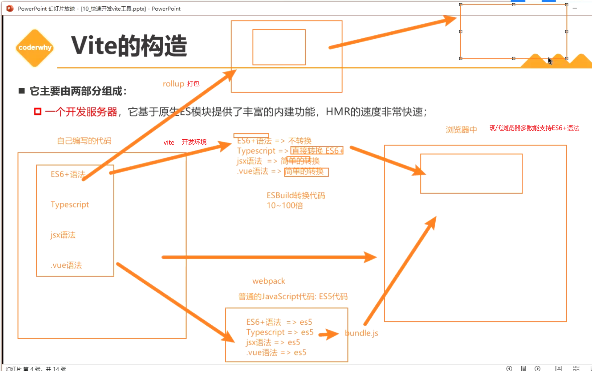
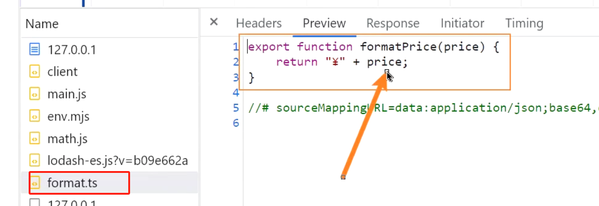
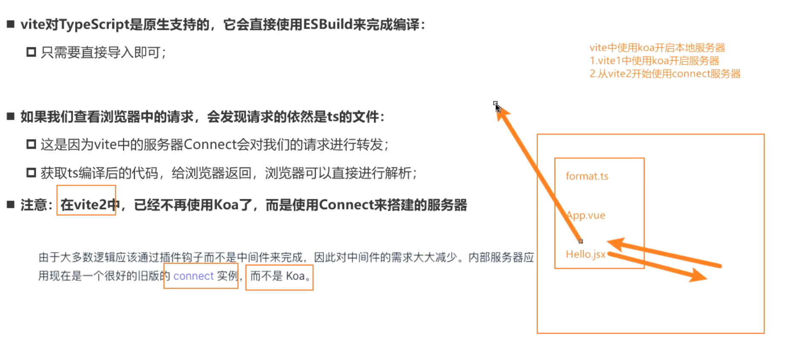
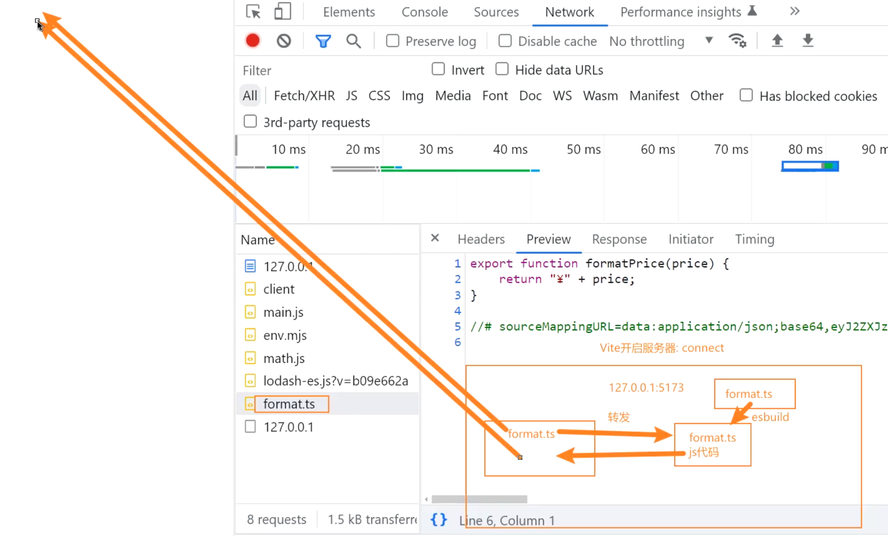
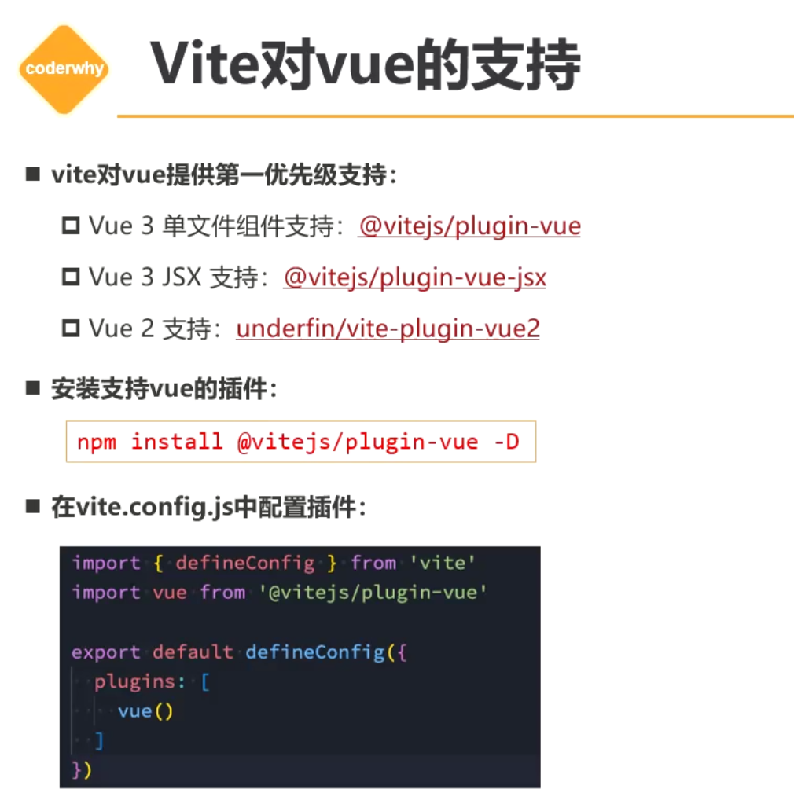
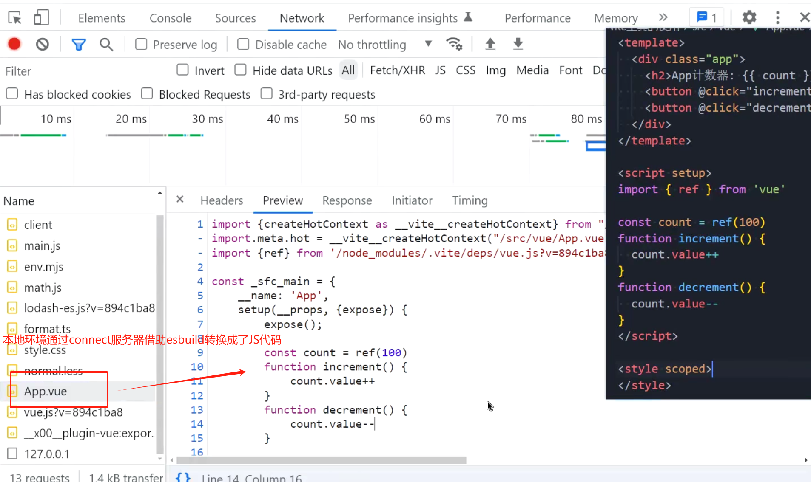
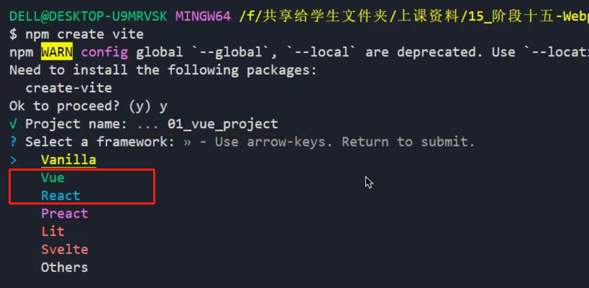
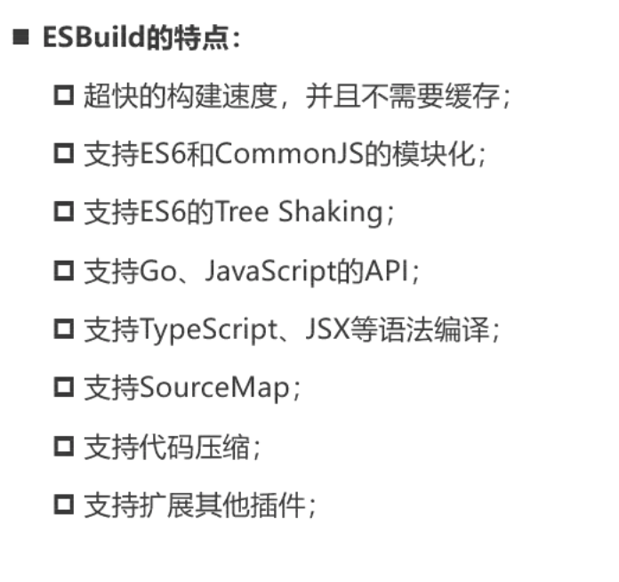
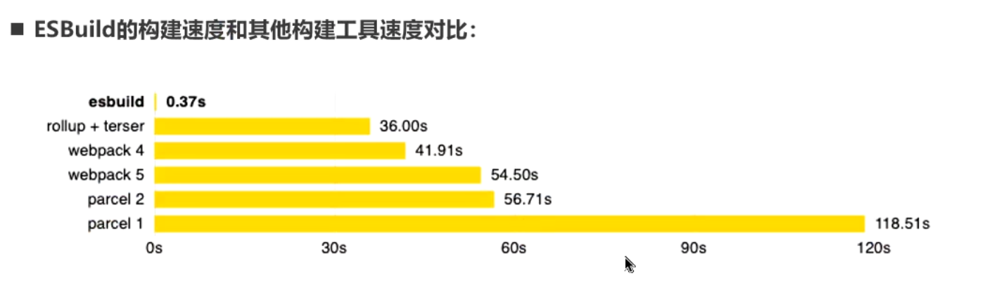

# Vite

## Vite的构造

一个开发服务器，基于原生ES模块提供丰富的内建功能，HMR的速度非常迅速。



## 浏览器如何识别模块化内容

1. **模块声明：** 使用适当的语法声明模块。在CommonJS中，使用`require`和`module.exports`语句，而在ES6模块中，使用`import`和`export`语句。

   ```js
   // CommonJS
   const moduleA = require('./moduleA');
   module.exports = { /* module content */ };
   
   // ES6
   import moduleA from './moduleA';
   export default { /* module content */ };
   ```

2. **脚本类型：** 在HTML文件中，通过`<script>`标签加载JavaScript文件时，需要使用`type`属性指定脚本的类型。对于模块化的JavaScript，`type`属性的值应为`module`。

   ```html
   
   <script type="module" src="main.js"></script>
   ```

3. **相对路径：** 在模块化系统中，通过相对路径或模块名称引入其他模块。相对路径通常用于CommonJS和ES6模块。

   ```js
   // CommonJS
   const moduleA = require('./moduleA');
   
   // ES6
   import moduleA from './moduleA';
   ```

4. **加载和执行：** 当浏览器遇到`<script type="module">`标签时，会异步加载并执行脚本。浏览器会解析模块的依赖关系，确保它们按照正确的顺序加载。

5. **同源策略：** 浏览器实施同源策略，确保从一个源加载的模块不会访问另一个源的内容，除非该源明确允许。这是为了提高安全性。

6. **缓存：** 浏览器会缓存已加载的模块，以提高性能。如果模块已经加载过并且没有发生更改，浏览器可以从缓存中获取模块而不重新下载。

## 浏览器原生支持ES语法

在没有打包框架的前提下，如果使用浏览器直接展示es语法，会有以下强制要求：

1.必须写上明确的后缀名(`import xxx from 'xxx/xxx.js'`)

2.如果某一个模块加载很多其它的JS文件，那么这些JS文件都需要被依次加载

比如我们加载一个lodash第三方库，它的所有JS文件都会被加载和被浏览器拉出请求。

3.如果代码中有TS/JSX/VUE代码，浏览器无法识别。

那么我们如何解决上述问题呢？我们可以选择轻量级的vite。

## Vite的使用

`pnpm add vite`

1.经过vite导入的文件无需添加后缀名。

2.解决导入文件过多的问题，通过使用vite会自动到node_modules下找到lodash入口文件，会将其所有内容合并到同一个文件之中。

```js
// 使用vite会自动到node_modules下找到lodash入口文件，会将其所有内容合并到同一个文件之中
import _ from "lodash-es";
```

3.vite能够通过esbuild来自动解析和转化TS/VUE/JSX文件



4.vite中无需配置css的处理。

### vite解析TypeScript文件 



#### 开发阶段

vite通过connect插件开启一个服务器，将ts代码存入到这个服务器中。

然后在这个服务器中通过esbuld转换ts代码为js代码，在浏览器请求对应ts文件的时候，vite通过在自己的服务器把已经处理好的js文件转发浏览器面向ts文件的请求。



#### 生产环境

依旧使用babel插件对ts文件进行转换操作，使用rollup进行打包操作。

### vite配置less

vite无需对less进行任何配置，只需要安装less插件即可

`pnpm add less -D`

### vite添加浏览器前缀

 `pnpm add postcss postcss-preset-env -D`

无需在vite里面配置，只需要建立postcss.config.js文件进行配置即可

```js
module.exports = {
	plugins: [require("postcss-preset-env")],
};
```

PostCSS 是一个用 JavaScript 插件转换样式的工具。它的主要目的是通过使用插件处理 CSS，并且可以根据开发者的需求来定制这些插件。PostCSS 广泛用于处理 CSS，包括但不限于以下几个方面：

1. **兼容性处理：** PostCSS 可以用于处理 CSS 的浏览器兼容性问题。例如，Autoprefixer 是一个流行的 PostCSS 插件，它可以根据你所需的浏览器版本自动添加适当的 CSS 前缀，以确保你的样式在各种浏览器中都能正常工作。
2. **新特性支持：** PostCSS 使你能够在项目中使用尚未被所有浏览器原生支持的 CSS 特性。通过使用一些插件，你可以在你的样式中使用未来的 CSS 规范，而不用担心浏览器兼容性问题。例如，你可以使用 CSS Variables、CSS Grid 等新特性。
3. **性能优化：** PostCSS 还可以用于优化你的样式表，例如通过压缩、去除不必要的空格、合并相似的规则等操作，以提高页面加载性能。
4. **代码风格检查：** 通过使用 PostCSS 插件，你可以进行代码风格的检查和修复。例如，stylelint 是一个 PostCSS 插件，它可以帮助你强制执行样式表的代码风格规范。
5. **预处理器功能：** PostCSS 可以用作替代或与传统 CSS 预处理器（如 Sass、Less）一起使用。通过使用 PostCSS 插件，你可以添加类似于预处理器的功能，如变量、嵌套、混入等。
6. **自动化工具集成：** PostCSS 可以轻松集成到构建工具（如 webpack、gulp）中，从而在项目构建过程中自动处理样式表。

总体来说，PostCSS 是一个非常灵活的工具，可以根据项目需求选择性地使用插件，从而满足不同的样式处理需求。

### Vite中使用Vue





先安装插件

`pnpm add vue`

导入插件并且渲染到DOM上面。

**main.jsx**

```js
import VueApp from "./vue/App.vue";
import { createApp } from "vue";
......
......
// Vue代码渲染
const app = createApp(VueApp);
app.mount(document.querySelector("#app"));
```

为了支持.vue文件格式，我们还需要另外安装一个插件

`pnpm add @vitejs/plugin-vue -D`

我们对于Vue这一类框架，我们需要在vite.config.js里面配置Vue相关的支持特性。

同时为了解决代码提示辅助问题，我们可以借助defineConfig来解决提示配置，通过导出defineConfig，在里面写代码时会自动弹出很多提示。

**vite.config.js**

```js
import { defineConfig } from "vite";
import vue from "@vitejs/plugin-vue";
export default defineConfig({
	plugins: [vue()],
});
```

### Vite使用React

`pnpm add react react-dom -D`

**App.jsx**

```js
import React, { useState } from "react";

function App() {
	const [count, setCount] = useState(100);
	return (
		<div className="App">
			<h2>React App计数器：{count}</h2>
			<button onClick={(e) => setCount(count + 1)}>+1</button>
			<button onClick={(e) => setCount(count - 1)}>-1</button>
		</div>
	);
}

export default App;

```

```js
import ReactApp from "./react/App.jsx";
import React from "react";
import ReactDom from "react-dom/client";

// React代码渲染
const root = ReactDom.createRoot(document.querySelector("#root"));
root.render(<ReactApp />);
```

## Vite的打包

`npx vite build`

在完成打包以后，我们通过`npx vite preview`来预览打包后的文件。

## Vite脚手架的构建

- create-vite 各种框架项目
- create-vue 创建vue项目

`npm create vite`




# ESBuild解析





- ESBuild使用Go语言编写，直接转换成机器代码，无需经过字节码。
- ESBuild充分利用CPU的多核性能，尽量使其饱和运行。
- ESBuild所有内容从零开始编写，没有历史包袱。

Vite在开发环境使用ESBuild编译代码，但是在生产环境还是使用了Rollup进行打包操作，Rollup的JS代码转化还是依赖于babel插件。